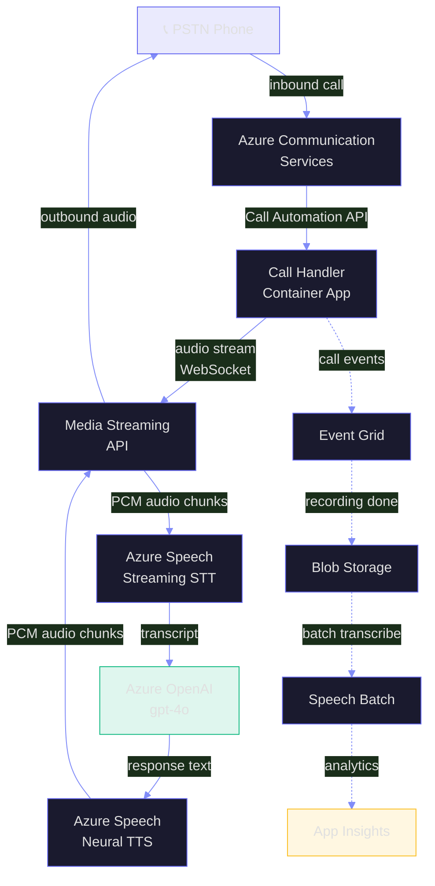
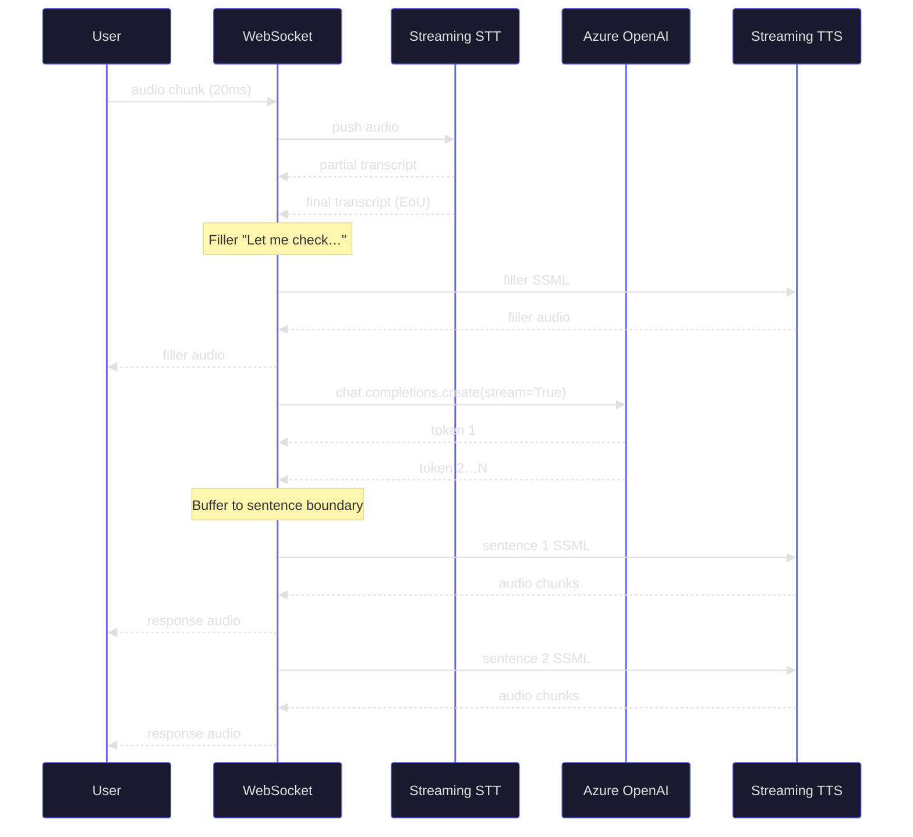

# V1: Voice & Speech AI — Real-Time Conversational Systems

> **Duration:** 60–90 minutes | **Level:** Deep-Dive
> **Part of:** 🎙️ FROOT Voice Layer
> **Prerequisites:** F1 (GenAI Foundations), R1 (Prompt Engineering), O5 (AI Infrastructure)
> **Last Updated:** May 2026

---

## Table of Contents

- [V1.1 The Voice AI Problem](#v11-the-voice-ai-problem)
- [V1.2 Azure AI Speech Service](#v12-azure-ai-speech-service)
- [V1.3 Azure Communication Services](#v13-azure-communication-services)
- [V1.4 Real-Time Audio Architecture](#v14-real-time-audio-architecture)
- [V1.5 Voice Agent Patterns](#v15-voice-agent-patterns)
- [V1.6 SSML & Prosody Control](#v16-ssml--prosody-control)
- [V1.7 STT → LLM → TTS Pipelines](#v17-stt--llm--tts-pipelines)
- [V1.8 Telephony Integration](#v18-telephony-integration)
- [V1.9 WAF Alignment for Voice AI](#v19-waf-alignment-for-voice-ai)
- [V1.10 Production Patterns & Anti-Patterns](#v110-production-patterns--anti-patterns)
- [Key Takeaways](#key-takeaways)

---

## V1.1 The Voice AI Problem

You've been asked to build a **call center voice AI** that handles tier-1 customer support over the phone. The system must:

- Understand customers in real time (no batch transcription)
- Respond within **800ms end-to-end** (the perceived "natural" pause)
- Handle interruptions (barge-in)
- Sound human (not robotic IVR)
- Hand off to human agents when needed
- Record and analyze every call

Voice AI is **the hardest end-to-end AI problem** because it is the only one where every architecture decision is constrained by **a single human-perceptible latency budget**. Text RAG can take 3 seconds. A voice agent that pauses 3 seconds feels broken.

### The Latency Budget

```mermaid
%%{init: {'theme': 'base', 'themeVariables': {'primaryColor': '#1a1a2e', 'primaryTextColor': '#e0e0e0', 'primaryBorderColor': '#6366f1', 'lineColor': '#818cf8', 'background': 'transparent'}}}%%
flowchart LR
    USER[👤 User stops<br/>speaking] -->|0ms| EOU[End-of-Utterance<br/>detection: 200-400ms]
    EOU -->|400ms| STT[STT finalization<br/>50-150ms]
    STT -->|550ms| LLM[LLM first token<br/>200-500ms]
    LLM -->|750ms| TTS[TTS first audio<br/>100-300ms]
    TTS -->|850ms| AUDIO[👂 First sound<br/>reaches user]
    
    style USER fill:#10b98122,stroke:#10b981
    style AUDIO fill:#10b98122,stroke:#10b981
    style EOU fill:#fbbf2422,stroke:#fbbf24
    style STT fill:#fbbf2422,stroke:#fbbf24
    style LLM fill:#ef444422,stroke:#ef4444
    style TTS fill:#fbbf2422,stroke:#fbbf24
```



**The hard truth:** Most production voice AI systems land between 700ms (excellent) and 1500ms (acceptable). Below 500ms feels superhuman. Above 2000ms feels broken.

### Why Voice AI ≠ Text AI

| Concern | Text RAG | Voice AI |
|---------|----------|----------|
| Latency tolerance | 3-10s acceptable | 800ms hard ceiling |
| Streaming | Optional UX polish | Mandatory architecture choice |
| Errors | User re-reads | User confused, asks again |
| Context window | Full chat history | Last 5-10 turns max (latency) |
| Modality | Pure text | Audio + transcript + intent |
| Failure mode | Wrong answer in text | Awkward silence on phone |
| Cost driver | Tokens | Audio minutes + LLM tokens |
| Test feedback loop | Diff strings | Listen to recordings |

---

## V1.2 Azure AI Speech Service

**Azure AI Speech** is the workhorse for STT, TTS, translation, and speaker recognition on Azure. For voice AI, three capabilities matter most.

### Capability 1: Real-Time Speech-to-Text (Streaming STT)

Streaming STT is the difference between "press the button to talk" and a conversation. Azure Speech SDK provides a `SpeechRecognizer` with continuous recognition, partial results, and end-of-utterance detection.

```python
# Python — Azure Speech SDK streaming STT
import azure.cognitiveservices.speech as speechsdk
from azure.identity import DefaultAzureCredential

# Use Managed Identity in production — never API keys
credential = DefaultAzureCredential()
token = credential.get_token("https://cognitiveservices.azure.com/.default")
speech_config = speechsdk.SpeechConfig(
    auth_token=f"aad#{RESOURCE_ID}#{token.token}",
    region="eastus2",
)
speech_config.speech_recognition_language = "en-US"
speech_config.set_property(
    speechsdk.PropertyId.SpeechServiceConnection_EndSilenceTimeoutMs, "500"
)
speech_config.set_property(
    speechsdk.PropertyId.SpeechServiceConnection_InitialSilenceTimeoutMs, "5000"
)

audio_input = speechsdk.audio.AudioConfig(use_default_microphone=True)
recognizer = speechsdk.SpeechRecognizer(
    speech_config=speech_config, audio_config=audio_input
)

def handle_partial(evt):
    print(f"[partial] {evt.result.text}", flush=True)

def handle_final(evt):
    print(f"[final]   {evt.result.text}", flush=True)
    # Send to LLM here — don't wait for session_stopped

recognizer.recognizing.connect(handle_partial)
recognizer.recognized.connect(handle_final)
recognizer.start_continuous_recognition()
```

**Production knobs:**

- `EndSilenceTimeoutMs`: 300–700ms. Lower = faster turn-taking, more false EoU. Higher = patient, but feels slow.
- `InitialSilenceTimeoutMs`: 5000–10000ms. How long to wait before declaring "no speech."
- **Phrase lists**: bias the recognizer toward expected vocabulary (product names, account numbers).
- **Custom Speech**: train on domain audio for accuracy gains in noisy/accented environments.

### Capability 2: Neural TTS (Streaming Synthesis)

The neural voice library has 400+ voices in 140+ languages, with multi-style voices that can switch between cheerful, sad, angry, customer-service. Streaming TTS sends audio chunks as they're generated — critical for sub-second response.

```python
# Python — Neural TTS with streaming
synthesizer = speechsdk.SpeechSynthesizer(
    speech_config=speech_config,
    audio_config=None,  # we'll handle the stream ourselves
)

def on_audio_chunk(evt):
    chunk_bytes = evt.result.audio_data
    # Push to outbound WebSocket / RTP / phone line
    outbound_stream.write(chunk_bytes)

synthesizer.synthesizing.connect(on_audio_chunk)

# Start synthesis — first chunk arrives in ~150-300ms
ssml = f"""<speak version='1.0' xmlns='http://www.w3.org/2001/10/synthesis'
  xmlns:mstts='https://www.w3.org/2001/mstts' xml:lang='en-US'>
  <voice name='en-US-AvaMultilingualNeural'>
    <mstts:express-as style='customerservice' styledegree='1.5'>
      {response_text}
    </mstts:express-as>
  </voice>
</speak>"""
synthesizer.start_speaking_ssml_async(ssml)
```

**Voice selection guide:**

| Voice | Best For | Notes |
|-------|----------|-------|
| `en-US-AvaMultilingualNeural` | Customer service, multilingual | Newest, most expressive |
| `en-US-AndrewMultilingualNeural` | Authoritative, professional | Pairs with Ava |
| `en-US-EmmaNeural` | Friendly, casual | Lower latency than Ava |
| `en-US-JennyMultilingualNeural` | Stable production workhorse | Battle-tested in M365 |

### Capability 3: Batch Transcription

For post-call analytics (NOT real-time), batch transcription gives 50% cost savings, speaker diarization, sentiment, and PII redaction.

```python
# Submit a batch job
from azure.ai.speech.batchclient import BatchClient

client = BatchClient(endpoint=f"https://{REGION}.api.cognitive.microsoft.com",
                    credential=credential)
job = client.transcriptions.submit_async(
    display_name="call-2026-05-02-001",
    locale="en-US",
    content_urls=["https://storage.../call-recording.wav"],
    properties={
        "diarizationEnabled": True,
        "punctuationMode": "DictatedAndAutomatic",
        "profanityFilterMode": "Masked",
        "wordLevelTimestampsEnabled": True,
        "languageIdentification": {"candidateLocales": ["en-US", "es-MX"]},
    },
)
```

---

## V1.3 Azure Communication Services

**Azure Communication Services (ACS)** provides PSTN connectivity, voice calling APIs, SMS, and chat — the "telephony plumbing" that connects an LLM agent to a real phone number.

### Architecture



### Call Automation API

The Call Automation API gives programmatic control: answer, transfer, mute, record, play audio, recognize DTMF, hang up.

```python
# Python — answer an incoming call and start media streaming
from azure.communication.callautomation import CallAutomationClient
from azure.communication.callautomation import (
    MediaStreamingOptions, MediaStreamingTransportType,
    MediaStreamingContentType, MediaStreamingAudioChannelType,
)

client = CallAutomationClient(
    endpoint=ACS_ENDPOINT, credential=DefaultAzureCredential()
)

def on_incoming_call(event):
    answer_call_result = client.answer_call(
        incoming_call_context=event.data["incomingCallContext"],
        callback_url=f"{APP_URL}/api/callbacks",
        media_streaming=MediaStreamingOptions(
            transport_url=f"wss://{APP_URL}/ws/audio",
            transport_type=MediaStreamingTransportType.WEBSOCKET,
            content_type=MediaStreamingContentType.AUDIO,
            audio_channel_type=MediaStreamingAudioChannelType.UNMIXED,
        ),
    )
```

### SIP Trunking & Direct Routing

For enterprise deployments with existing SIP infrastructure (e.g., Cisco, Avaya), ACS supports Direct Routing — bring your own carrier, terminate SIP at ACS, then route to your agents.

**When to choose what:**

- **PSTN calling plan**: Quickest to start. Microsoft is your carrier. US/EU regulated regions only.
- **Direct Routing**: Use existing SIP carrier, more control, complex setup, regulatory flexibility.
- **Operator Connect**: Hybrid — your carrier provisions through Microsoft.

---

## V1.4 Real-Time Audio Architecture

Real-time audio over WebSockets is unforgiving. Three architectural decisions dominate.

### Decision 1: Codec & Sampling Rate

| Codec | Sample Rate | Bitrate | Use For | Notes |
|-------|------------|---------|---------|-------|
| **PCM 16-bit** | 16 kHz mono | 256 kbps | STT input | Native for most STT engines |
| **PCM 16-bit** | 24 kHz mono | 384 kbps | TTS output | Higher fidelity for synthesis |
| **Opus** | 48 kHz | 24-128 kbps | WebRTC | Best for browser ↔ server |
| **G.711 (μ-law)** | 8 kHz mono | 64 kbps | PSTN | Required for telephony |
| **G.722** | 16 kHz mono | 64 kbps | HD voice over PSTN | Better than G.711 |

**Rule:** STT input at 16 kHz mono PCM. TTS output at 16/24 kHz mono PCM. Telephony bridges resample to 8 kHz μ-law at the edge.

### Decision 2: Chunk Size

- **20ms chunks** — industry standard for VoIP, smooth playback, low latency
- **40-100ms chunks** — acceptable for cloud streaming, halves WebSocket frame overhead
- **>200ms chunks** — perceptible delay, breaks barge-in detection

### Decision 3: Backpressure & Buffering

Real-time audio cannot tolerate buffering. Drop old audio, never queue more than 200ms. Use `await ws.send_bytes(chunk)` with a timeout — if the client can't keep up, hang up the call cleanly.

```python
# FastAPI WebSocket audio handler with backpressure
from fastapi import WebSocket, WebSocketDisconnect
import asyncio

@app.websocket("/ws/audio")
async def audio_ws(ws: WebSocket):
    await ws.accept()
    audio_queue = asyncio.Queue(maxsize=10)  # ~200ms at 20ms chunks

    async def receive_audio():
        while True:
            try:
                chunk = await asyncio.wait_for(ws.receive_bytes(), timeout=5.0)
            except (asyncio.TimeoutError, WebSocketDisconnect):
                break
            try:
                audio_queue.put_nowait(chunk)
            except asyncio.QueueFull:
                # Drop oldest, keep newest — never lag real-time
                _ = audio_queue.get_nowait()
                audio_queue.put_nowait(chunk)

    async def feed_stt():
        while True:
            chunk = await audio_queue.get()
            recognizer.push_audio(chunk)

    await asyncio.gather(receive_audio(), feed_stt())
```

---

## V1.5 Voice Agent Patterns

### Turn-Taking

Humans use prosody, gaze, and breathing to negotiate turns. Voice AI uses **silence detection** + **endpoint detection**:

- **Voice Activity Detection (VAD)** — is anyone speaking?
- **End-of-Utterance (EoU) detection** — did the speaker finish?
- **Backchannel detection** — was that "uh-huh" a real turn or just acknowledgment?

```python
# Backchannel filter — don't interrupt the user for "uh-huh", "okay", "right"
BACKCHANNELS = {"uh-huh", "okay", "right", "yeah", "mm-hmm", "got it", "i see"}

def is_real_turn(transcript: str) -> bool:
    cleaned = transcript.lower().strip().rstrip(".!?")
    return cleaned not in BACKCHANNELS and len(cleaned.split()) > 1
```

### Barge-In

When the user starts speaking while the agent is talking, **stop the TTS immediately** and start listening. This requires:

1. Continuous STT running even while TTS is playing
2. Echo cancellation on the audio stream (or only one direction at a time)
3. A "stop synthesis" call on the TTS engine
4. Marker the in-progress LLM response as "interrupted" — don't continue it

```python
async def on_user_started_speaking():
    if synthesizer.is_speaking:
        synthesizer.stop_speaking_async()
    if llm_task and not llm_task.done():
        llm_task.cancel()  # abandon in-flight response
```

### Filler Phrases

Hide latency with non-committal acknowledgments while the LLM thinks:

```python
FILLERS = [
    "Let me check that for you.",
    "One moment, please.",
    "Looking that up now.",
    "Just a second.",
]

# Speak a filler immediately on EoU, in parallel with LLM call
asyncio.create_task(speak(random.choice(FILLERS)))
llm_task = asyncio.create_task(call_llm(transcript))
response = await llm_task
await speak(response)
```

### Silence Handling

If the user pauses too long, prompt gently rather than wait forever.

| Silence | Action |
|---------|--------|
| 1.5s | Continue listening (natural pause) |
| 5s | "I'm still here. Take your time." |
| 15s | "Are you still there?" |
| 30s | "I'll let you go for now. Goodbye." |

---

## V1.6 SSML & Prosody Control

Speech Synthesis Markup Language is the difference between robotic and human-sounding TTS.

### Essential SSML Tags

```xml
<speak version="1.0" xml:lang="en-US"
       xmlns:mstts="https://www.w3.org/2001/mstts">
  <voice name="en-US-AvaMultilingualNeural">

    <!-- Style: customerservice, cheerful, sad, angry, excited -->
    <mstts:express-as style="customerservice" styledegree="1.5">
      Welcome to Contoso. <break time="200ms"/>
      How can I help you today?
    </mstts:express-as>

    <!-- Emphasis -->
    Your <emphasis level="strong">order number</emphasis>
    is <say-as interpret-as="characters">A1B2C3</say-as>.

    <!-- Numbers, dates, currency -->
    Your refund of <say-as interpret-as="currency">$129.99</say-as>
    will arrive on <say-as interpret-as="date" format="mdy">5/15/2026</say-as>.

    <!-- Phone numbers -->
    Please call <say-as interpret-as="telephone">1-800-555-0123</say-as>.

    <!-- Slower for important info -->
    <prosody rate="slow">Your confirmation code is 7-4-9-2-1.</prosody>

  </voice>
</speak>
```

### Multilingual Switching

Multilingual voices (`*MultilingualNeural`) automatically switch language based on text — no `<voice>` tag changes needed:

```xml
<voice name="en-US-AvaMultilingualNeural">
  Welcome. <lang xml:lang="es-MX">Bienvenido.</lang>
  <lang xml:lang="fr-FR">Bienvenue.</lang>
</voice>
```

### Style Examples

| Style | When to Use |
|-------|-------------|
| `customerservice` | Default for support agents |
| `cheerful` | Greetings, confirmations |
| `empathetic` | Apologies, complaint handling |
| `calm` | De-escalation, security topics |
| `newscast-formal` | Reading policies, terms |
| `chat` | Casual conversation, coaching bots |

---

## V1.7 STT → LLM → TTS Pipelines

The full pipeline wiring is where most projects struggle. Here is the production pattern.

### Pipeline Diagram



### Key Optimization: Sentence-Level TTS

Don't wait for the LLM to finish. Stream tokens, buffer to the first sentence boundary (`. ! ?`), send to TTS, continue accumulating the next sentence in parallel.

```python
async def stream_llm_to_tts(transcript: str):
    response = await openai.chat.completions.create(
        model="gpt-4o",
        messages=conversation_history + [{"role": "user", "content": transcript}],
        stream=True,
        temperature=0.3,
        max_tokens=200,  # cap to keep responses tight for voice
    )

    buffer = ""
    async for chunk in response:
        delta = chunk.choices[0].delta.content or ""
        buffer += delta
        # Detect sentence boundary
        for terminator in [". ", "! ", "? ", ".\n", "!\n", "?\n"]:
            if terminator in buffer:
                sentence, buffer = buffer.split(terminator, 1)
                await speak_async(sentence + terminator.strip())
                break
    if buffer.strip():
        await speak_async(buffer.strip())
```

### Conversation Memory

Voice conversations need shorter context windows than text chat — every extra message adds latency.

- **Last 5–10 turns** in the prompt
- **Summarize beyond 10 turns** with a quick `gpt-4o-mini` summarization call between turns
- **Persist full transcript** in Cosmos DB for post-call analytics

---

## V1.8 Telephony Integration

### IVR Replacement Pattern

The classic IVR ("press 1 for sales, press 2 for support") is being replaced by natural-language routers. Voice AI handles the routing decision in 1–2 turns instead of 30 seconds of menu navigation.

```python
INTENT_SYSTEM_PROMPT = """
You route customer calls to the right team. Output ONLY one of:
- "billing" — billing questions, refunds, charges
- "technical" — product not working, errors, bugs
- "sales" — new orders, upgrades, pricing
- "human" — caller asked for a human, complex case, angry tone
- "unknown" — unclear after one clarification

After your label, output a short greeting line for the caller.
"""

async def route_call(transcript: str) -> tuple[str, str]:
    response = await openai.chat.completions.create(
        model="gpt-4o-mini",  # fast for routing
        messages=[
            {"role": "system", "content": INTENT_SYSTEM_PROMPT},
            {"role": "user", "content": transcript},
        ],
        response_format={"type": "json_object"},
        max_tokens=80,
    )
    parsed = json.loads(response.choices[0].message.content)
    return parsed["intent"], parsed["greeting"]
```

### Call Recording & Diarization

Record both legs of the call to a single stereo file (caller on left channel, agent on right). Send to batch transcription with diarization enabled — get per-speaker transcripts ready for analytics.

### DTMF Tones

Some workflows still need DTMF (entering account numbers, PIN). Mix natural language with DTMF capture:

```python
# Ask for account number, accept either spoken digits or DTMF
recognize_result = await call_connection.recognize_async(
    target_participant=caller,
    operation_options={
        "input_type": "speech_or_dtmf",
        "max_tones_to_collect": 8,
        "stop_tones": ["#"],
        "play_prompt": "Please say or enter your 8-digit account number, then press pound.",
    },
)
```

### Compliance Recording

Many regions require **two-party consent** for recording. Play a disclosure message at call start:

> "This call may be recorded for quality and training purposes. To opt out, please say 'do not record' now."

Store recordings in Blob Storage with **Customer-Managed Keys** and a **Time-Based Immutability Policy** matching your retention requirement (typically 7 years for regulated industries).

---

## V1.9 WAF Alignment for Voice AI

### Reliability

- **Regional failover**: Speech and OpenAI in two regions, Front Door routes between them. Active-active for sub-second failover.
- **Connection retries**: WebSocket reconnect with exponential backoff (200ms, 500ms, 1s, 2s, fail).
- **Circuit breakers**: If LLM latency p99 > 1s for 30s, drop to a simpler `gpt-4o-mini` fallback.
- **Graceful degradation**: If TTS fails, fall back to a pre-recorded "We're experiencing technical difficulties, transferring you now" prompt.

### Security

- **Managed Identity** for every Azure service-to-service call. Never API keys in code.
- **PII redaction** in transcripts before sending to LLM and before logging. Azure AI Language PII detection or regex for known patterns (SSN, credit card).
- **PHI handling** for healthcare: deploy in HIPAA-eligible regions, sign BAA, use customer-managed keys, redact in real time.
- **Prompt injection defense**: voice transcripts are user input — apply the same defenses as text. Use Prompt Shields, validate intent, never let the user redirect the agent's persona.
- **Recording consent**: legally mandatory in many jurisdictions. Audit trail of consent.

### Cost Optimization

- **PTU vs PAYG**: For >100 concurrent calls, Provisioned Throughput Units beat Pay-As-You-Go by 30–60%.
- **Model routing**: `gpt-4o-mini` for intent classification (90% of routing decisions), `gpt-4o` only for complex reasoning.
- **TTS voice tier**: Standard neural voices are cheaper than HD multilingual. Use HD only when expressivity matters.
- **Audio storage**: Cool tier for recordings older than 30 days. Archive after 1 year. Delete after retention policy.
- **Batch transcription** for analytics is 50% cheaper than real-time.

### Performance Efficiency

- **Warm pool**: keep N container instances pre-warmed to absorb call spikes (call center morning rush).
- **Connection pooling**: reuse Speech and OpenAI clients across calls. Cold connect adds 200–500ms.
- **Region pinning**: deploy STT, LLM, TTS in the same region. Cross-region adds 50–100ms per hop.
- **Audio codec choice**: PCM avoids encode/decode overhead vs Opus when bandwidth is plentiful.

### Operational Excellence

- **Real-time dashboards**: Application Insights with per-call latency breakdown (STT, LLM, TTS, total).
- **Quality metrics**: end-of-call CSAT, transcription accuracy (sample 1% for human review), task completion rate.
- **Replay**: store transcripts + audio for last 7 days, queryable by call ID.
- **A/B testing**: route 5% of calls to new prompt version, compare CSAT and avg call duration.

### Responsible AI

- **Disclosure**: every voice agent must announce itself as AI within the first turn.
- **Hand-off path**: clear, fast escalation to a human agent on request.
- **Bias audit**: test recognition accuracy across accents, dialects, age groups quarterly.
- **Recording rights**: caller can request deletion under GDPR; build a deletion API.
- **Content safety**: apply Azure Content Safety to LLM output — voice agents have shipped harmful advice in past incidents.

---

## V1.10 Production Patterns & Anti-Patterns

### Patterns That Work

| Pattern | Why |
|---------|-----|
| **Sentence-level TTS streaming** | Cuts perceived latency by 30-50% |
| **Filler phrases during LLM call** | Hides 500ms of think time |
| **Backchannel filtering** | Prevents accidental interruption |
| **Short conversation memory (5-10 turns)** | Keeps prompt small and fast |
| **`gpt-4o-mini` for routing, `gpt-4o` for content** | 80% cost reduction with quality preserved |
| **Pre-warmed container instances** | Eliminates cold-start latency |
| **Two-region active-active** | Sub-second failover |
| **Per-call correlation ID** | Traceability across STT/LLM/TTS spans |

### Anti-Patterns to Avoid

| Anti-Pattern | Why It Fails |
|--------------|--------------|
| **Wait for full LLM response before TTS** | Perceived latency 2-3s |
| **`gpt-4o` for every turn** | Cost explosion, no quality gain on routing |
| **Long system prompts (>2000 tokens)** | Adds 200ms+ per turn |
| **Buffering audio queue without bounds** | Latency drift, eventually breaks barge-in |
| **API keys in source** | Security incident waiting to happen |
| **No barge-in support** | Users hate being talked over |
| **Robotic IVR-style prompts** | Users hang up, prefer human |
| **Synchronous file-based session state** | Race conditions on concurrent calls |
| **Cross-region STT + LLM + TTS** | Adds 100-200ms per hop, breaks budget |
| **No PII redaction** | Regulatory and reputational risk |

### The Voice AI Maturity Model

| Stage | Capability | Latency |
|-------|------------|---------|
| **0 — IVR** | Touch-tone menus | N/A |
| **1 — Bot** | Say "yes/no", basic intent | 1500ms+ |
| **2 — Assistant** | Full conversation, single domain | 1000-1500ms |
| **3 — Agent** | Multi-turn, tool use, hand-off | 800-1200ms |
| **4 — Voice-First Product** | Sub-second, indistinguishable from human | <800ms |

Most production deployments today are at Stage 2-3. Stage 4 requires custom voice fine-tuning, dedicated PTU, and aggressive engineering on every component.

---

## Key Takeaways

1. **Latency is the master constraint.** Every architectural decision flows from the 800ms end-to-end budget.
2. **Stream everything.** Streaming STT, streaming LLM tokens, streaming TTS — anything else breaks the budget.
3. **Azure Speech + Azure Communication Services + Azure OpenAI** is the canonical stack on Azure. Speech for STT/TTS, ACS for telephony, OpenAI for the agent brain.
4. **Sentence-level TTS** beats waiting for full LLM responses by hundreds of milliseconds.
5. **Filler phrases** turn 500ms of awkward silence into a natural acknowledgment.
6. **Backchannel filtering** stops accidental interruption from "uh-huh" and "okay."
7. **Two regions + active-active routing** = sub-second failover, the only viable HA story for voice.
8. **Cost: route with `gpt-4o-mini`, respond with `gpt-4o`.** 80% cost reduction with no quality loss.
9. **PII redaction is non-negotiable** — voice transcripts hit logs, LLMs, and storage.
10. **Recording consent is legally required** in many regions. Disclose at call start. Audit it.

---

## Cross-References

- **F1 (GenAI Foundations)** — Token budget intuitions for short voice responses
- **R1 (Prompt Engineering)** — System prompt design for short, conversational responses
- **R3 (Deterministic AI)** — Reducing hallucination matters more in voice (no second chance to read)
- **O3 (MCP, Tools & Function Calling)** — Agent tool calling for real actions during calls
- **O5 (AI Infrastructure)** — Container Apps for the call handler, AKS for high-concurrency
- **T2 (Responsible AI)** — Content safety for voice output, bias audits across accents
- **T3 (Production Patterns)** — Multi-region patterns, observability for AI workloads

## Related Solution Plays

- **Play 04** — Call Center Voice AI (full reference implementation)
- **Play 14** — Cost-Optimized AI Gateway (voice routing patterns)
- **Play 17** — AI Observability (voice latency dashboards)
- **Play 22** — Swarm Orchestration (voice agents calling specialist agents)
