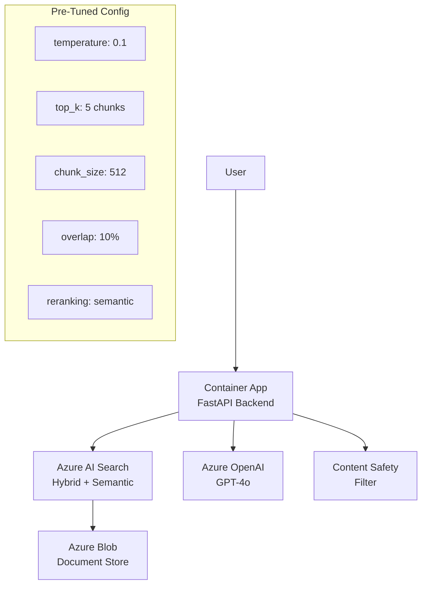

# Solution Play 01: Enterprise RAG Q&A

> **Complexity:** Medium | **Deploy time:** 15 minutes | **AI tuning:** Pre-configured
> **Target persona:** Infrastructure & platform engineers deploying enterprise Q&A

---

## What This Deploys

A production-ready Retrieval-Augmented Generation (RAG) pipeline that answers questions from your enterprise documents — with pre-tuned AI parameters, semantic ranking, and evaluation pipeline.

```
User Question → Azure AI Search (hybrid retrieval) → Semantic Reranker
             → Azure OpenAI (grounded generation) → Validated Answer
```

## Architecture



## Pre-Tuned AI Configuration

| Parameter | Value | Why This Value |
|-----------|-------|---------------|
| **Model** | gpt-4o | Best quality/speed for enterprise Q&A |
| **Temperature** | 0.1 | Near-deterministic — factual answers, minimal variation |
| **Top-p** | 0.9 | Focused but allows natural phrasing |
| **Max tokens** | 1000 | Enough for detailed answers, controls cost |
| **Chunk size** | 512 tokens | Balances specificity and context |
| **Chunk overlap** | 10% (51 tokens) | Prevents info loss at boundaries |
| **Top-K retrieval** | 5 | Enough context without noise |
| **Search type** | Hybrid (vector + BM25) | Outperforms either alone |
| **Reranking** | Semantic (cross-encoder) | 20-40% quality improvement |
| **Relevance threshold** | 0.78 cosine | Filters irrelevant matches |

## Quick Deploy

```bash
# 1. Clone FrootAI
git clone https://github.com/gitpavleenbali/frootai.git
cd frootai/solution-plays/01-enterprise-rag

# 2. Deploy infrastructure
az deployment group create \
  --resource-group myRG \
  --template-file infra/main.bicep \
  --parameters infra/parameters.json

# 3. Upload your documents
az storage blob upload-batch \
  --destination documents \
  --source ./your-docs/

# 4. Index documents (auto-chunks with config)
python plugins/indexer.py

# 5. Test with evaluation set
python evaluation/eval.py
```

## What the Infra Person Controls

| Knob | File | What It Does |
|------|------|-------------|
| Model choice | `config/openai.json` | Switch between gpt-4o, gpt-4o-mini, Phi-4 |
| Temperature | `config/openai.json` | 0.0 = deterministic, 0.3 = balanced |
| Chunk strategy | `config/chunking.json` | Size, overlap, method (semantic vs fixed) |
| Search tuning | `config/search.json` | Hybrid weights, reranking, filters |
| Guardrails | `instructions.md` | System prompt rules, citation requirements |
| Agent behavior | `agent.md` | Personality, constraints, tool access |

## Agent Instructions

See [agent.md](./agent.md) — pre-written system prompt that:
- Always cites source documents
- Refuses to answer when retrieval score < 0.78
- Uses structured JSON output for API consumers
- Includes 3 few-shot examples for consistent formatting

## Evaluation

The included test set (`evaluation/test-set.jsonl`) contains 100 Q&A pairs. Run `python evaluation/eval.py` to score:
- **Faithfulness**: Does the answer match the source documents?
- **Relevance**: Does it actually answer the question?
- **Groundedness**: Is every claim backed by a citation?

Target scores: Faithfulness > 0.90, Relevance > 0.85, Groundedness > 0.95

---

> **FrootAI Solution Play 01** — Enterprise RAG, pre-tuned and production-ready.
