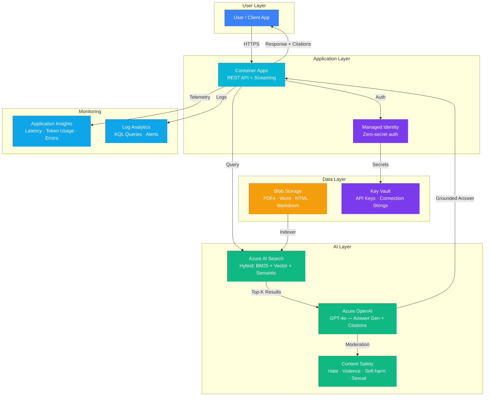

# Architecture — Play 01: Enterprise RAG Q&A

## Overview

Production-grade Retrieval-Augmented Generation pipeline. Users ask questions, the system retrieves relevant documents via hybrid search (keyword + vector + semantic reranking), then generates grounded answers with citations using GPT-4o.

## Architecture Diagram

## Data Flow

1. **Ingestion**: Documents (PDF, Word, HTML) uploaded to Blob Storage → AI Search Indexer processes and chunks them (512 tokens, semantic chunking, 10% overlap) → Vector embeddings generated via text-embedding-3-large
2. **Query**: User sends question → Container Apps API receives request → AI Search performs hybrid retrieval (BM25 keyword + vector similarity + semantic reranking) → Returns top-5 relevant chunks
3. **Generation**: Top-5 chunks passed as context to GPT-4o → Model generates answer grounded in the retrieved documents → Citations extracted and linked to source documents
4. **Safety**: Response passes through Content Safety filter → Blocks hate, violence, self-harm, sexual content → Response returned to user with citations
5. **Monitoring**: Every request logged to Application Insights (latency, token count, search score) → Log Analytics for KQL queries and alerting

## Service Roles

| Service | Layer | Role |
|---------|-------|------|
| Container Apps | Compute | API hosting, auto-scaling, HTTPS ingress |
| Azure AI Search | AI | Hybrid search index, semantic reranking |
| Azure OpenAI (GPT-4o) | AI | Answer generation with citation grounding |
| Content Safety | AI | Response moderation, category filtering |
| Blob Storage | Data | Document storage, indexing source |
| Key Vault | Security | API keys, connection strings, managed identity |
| Managed Identity | Security | Zero-secret service-to-service auth |
| Application Insights | Monitoring | APM, distributed tracing, custom AI metrics |
| Log Analytics | Monitoring | Centralized logging, KQL, alert rules |

## Security Architecture

- **Managed Identity**: All service-to-service auth — no connection strings in code
- **Key Vault**: API keys rotated automatically, referenced via `@Microsoft.KeyVault()`
- **Private Endpoints**: AI Search and OpenAI accessible only via VNet (production)
- **Content Safety**: All AI responses filtered before reaching users
- **RBAC**: Least-privilege roles per service principal

## Scaling

| Metric | Dev | Production | Enterprise |
|--------|-----|-----------|------------|
| Concurrent users | 5-10 | 100-500 | 1,000+ |
| Documents indexed | 1K | 100K | 1M+ |
| Requests/minute | 10 | 100 | 500+ |
| Container replicas | 1 | 2-5 | 5-20 |
| Search replicas | 1 | 2 | 3-6 |
