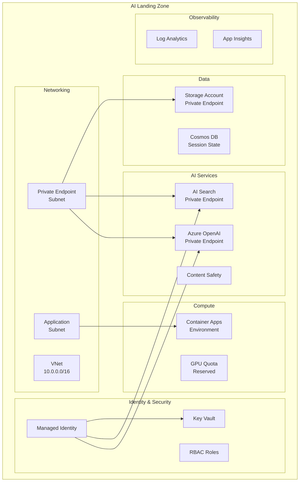

# Solution Play 02: AI Landing Zone

> **Complexity:** Foundation | **Deploy time:** 20 minutes | **AI tuning:** N/A (infra only)
> **Target persona:** Cloud architects & platform engineers setting up enterprise AI infrastructure

---

## What This Deploys

The foundational Azure infrastructure that every AI workload needs — networking, identity, governance, compute quotas, and private connectivity. Deploy this FIRST, then layer solution plays on top.

```
AI Landing Zone = VNet + Private Endpoints + Managed Identity
               + RBAC + GPU Quota + Key Vault + Monitoring
               + AI Search + Azure OpenAI + Storage
```

## Architecture



## What Gets Created

| Resource | SKU/Config | Why |
|----------|-----------|-----|
| **VNet** | /16 with 3 subnets | Network isolation for all AI services |
| **Azure OpenAI** | Standard S0 + private endpoint | Model hosting, no public access |
| **AI Search** | Standard S1 + private endpoint | Vector + semantic search |
| **Storage Account** | Standard LRS + private endpoint | Document and data storage |
| **Key Vault** | Standard + RBAC | Secrets, keys, certificates |
| **Managed Identity** | User-assigned | Passwordless auth to all services |
| **Container Apps Env** | Consumption plan | Agent/API hosting with auto-scale |
| **Log Analytics + App Insights** | Pay-as-you-go | Observability for all services |
| **Content Safety** | Standard | Input/output filtering |
| **RBAC** | Least-privilege roles | Cognitive Services User, Search Index Data Reader, etc. |

## Quick Deploy

```bash
cd frootai/solution-plays/02-ai-landing-zone

# Deploy the landing zone
az deployment group create \
  --resource-group myAI-RG \
  --template-file infra/main.bicep \
  --parameters infra/parameters.json \
  --parameters location=eastus2

# Verify connectivity
az network private-endpoint list --resource-group myAI-RG -o table
```

## Configuration

Edit `infra/parameters.json` to customize:

```json
{
  "location": "eastus2",
  "environmentName": "ai-prod",
  "openaiModelName": "gpt-4o",
  "openaiModelVersion": "2024-11-20",
  "openaiCapacity": 80,
  "searchSku": "standard",
  "enableGpuQuota": true,
  "gpuSku": "Standard_NC24ads_A100_v4",
  "gpuCount": 2
}
```

## Security Checklist

- [x] All AI services behind private endpoints
- [x] Managed Identity (no API keys in code)
- [x] Key Vault for any remaining secrets
- [x] RBAC with least-privilege roles
- [x] Network security groups on all subnets
- [x] Diagnostic logs to Log Analytics
- [x] Content Safety filter enabled

## Next Steps

Once the landing zone is deployed, layer these solution plays on top:
- **01-enterprise-rag** → Deploy RAG pipeline into this landing zone
- **03-deterministic-agent** → Deploy agent into Container Apps environment

---

> **FrootAI Solution Play 02** — The bedrock. Every AI solution grows from here.
