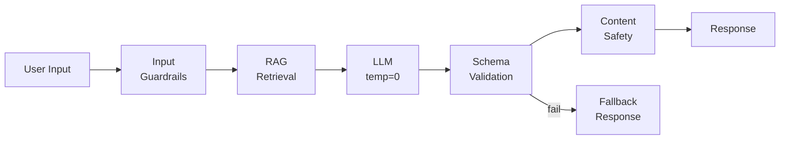

# Solution Play 03: Deterministic Agent

> **Complexity:** Medium | **Deploy time:** 10 minutes | **AI tuning:** Pre-configured
> **Target persona:** Platform engineers who need AI agents that don't hallucinate

---

## What This Deploys

A production agent that gives consistent, verifiable, grounded answers — with structured JSON output, multi-layer guardrails, and automated evaluation. When your agent MUST be reliable.

```
User → Input Guardrails → RAG Grounding → LLM (temp=0, structured)
     → Output Validation → Safety Filter → Verified Response
```

## Architecture



## Pre-Tuned Configuration

| Parameter | Value | Why |
|-----------|-------|-----|
| **Temperature** | 0.0 | Maximum determinism |
| **Seed** | 42 | Reproducible outputs |
| **Response format** | Strict JSON schema | Eliminates format hallucination |
| **Max tokens** | 500 | Concise, controlled responses |
| **Top-p** | 1.0 | Not needed at temp=0 |
| **Grounding** | RAG + citations required | Every claim must have a source |
| **Abstention** | Confidence < 0.7 = refuse | Better to say "I don't know" than guess |

## Agent Instructions

See [agent.md](./agent.md) — pre-written for deterministic behavior:
- Always outputs valid JSON matching the schema
- Refuses to answer when retrieval confidence < 0.7
- Every factual claim must cite a source document
- Corrects user errors instead of agreeing (anti-sycophancy)

## Quick Deploy

```bash
cd frootai/solution-plays/03-deterministic-agent

# Deploy to Container Apps (requires AI Landing Zone)
az containerapp up \
  --name deterministic-agent \
  --source . \
  --environment ai-prod-env

# Run evaluation
python evaluation/eval.py --test-set evaluation/test-set.jsonl
```

## Evaluation Targets

| Metric | Target | How Measured |
|--------|--------|-------------|
| **Consistency** | >95% same answer across 10 runs | Run 100 questions 10 times |
| **Faithfulness** | >0.90 | LLM-as-judge vs source docs |
| **Groundedness** | >0.95 | Citation count / claim count |
| **Abstention rate** | 80%+ on out-of-scope | Test with 50 out-of-scope questions |
| **Safety** | 0 failures | 100 adversarial prompts |

---

> **FrootAI Solution Play 03** — When AI must not fail.
