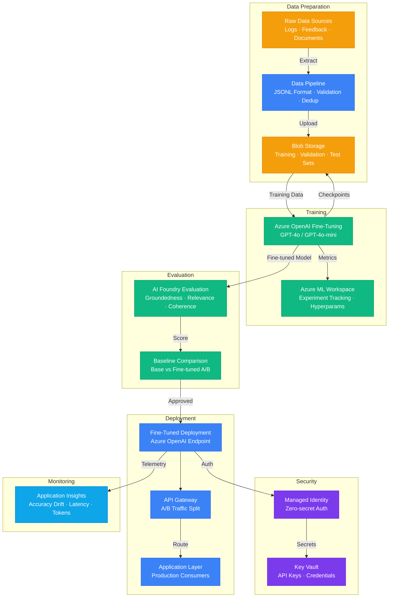

# Architecture — Play 13: Fine-Tuning Workflow

## Overview

End-to-end fine-tuning pipeline for customizing Azure OpenAI models with domain-specific data. The workflow covers data preparation (JSONL formatting, validation, deduplication), supervised fine-tuning with hyperparameter tuning, automated evaluation against baseline, and production deployment with A/B testing. Azure Machine Learning provides experiment tracking and model registry.

## Architecture Diagram

## Data Flow

1. **Data Collection**: Raw interaction logs, user feedback, and domain documents collected from production systems → Cleaned and formatted into JSONL (system/user/assistant message triplets)
2. **Validation**: Data pipeline validates format, removes duplicates, splits into train/validation/test sets (80/10/10) → Uploaded to Blob Storage with versioning
3. **Fine-Tuning**: Azure OpenAI fine-tuning job launched with training data → Hyperparameters (epochs, learning rate, batch size) tracked in Azure ML → Checkpoints saved to Blob
4. **Evaluation**: Fine-tuned model evaluated against test set using AI Foundry → Metrics: groundedness ≥ 4.0, relevance ≥ 4.0, coherence ≥ 4.5 → Compared against base model baseline
5. **Deployment**: If evaluation passes thresholds, model deployed to Azure OpenAI endpoint → API Gateway splits traffic (90% base / 10% fine-tuned) for A/B validation
6. **Monitoring**: Production metrics tracked in Application Insights → Accuracy drift detection triggers retraining alerts → Token usage and latency monitored per deployment

## Service Roles

| Service | Layer | Role |
|---------|-------|------|
| Azure OpenAI Fine-Tuning | AI | Supervised fine-tuning with custom JSONL datasets |
| Azure OpenAI Inference | AI | Hosting fine-tuned model deployments |
| Azure Machine Learning | AI | Experiment tracking, model registry, versioning |
| Azure AI Foundry | AI | Evaluation pipelines — quality scoring |
| Blob Storage | Data | Training data, checkpoints, evaluation results |
| Key Vault | Security | API keys, storage credentials |
| Managed Identity | Security | Service-to-service authentication |
| Application Insights | Monitoring | Accuracy drift, latency, token usage tracking |

## Security Architecture

- **Managed Identity**: All services authenticate via workload identity — no API keys in code
- **Data Isolation**: Training data stored in dedicated containers with SAS token access policies
- **Key Vault**: Fine-tuning API keys and endpoint secrets rotated automatically
- **RBAC**: Data scientists get ML Workspace Contributor; production gets Reader only
- **PII Handling**: Training data scanned for PII before fine-tuning — masked or removed
- **Audit Logging**: All fine-tuning jobs and model deployments logged for compliance

## Scaling

| Metric | Dev | Production | Enterprise |
|--------|-----|-----------|------------|
| Training data size | 500 examples | 5K-50K examples | 100K+ examples |
| Training frequency | Manual, ad-hoc | Monthly | Weekly / continuous |
| Concurrent fine-tune jobs | 1 | 2-3 | 5-10 |
| Evaluation runs per model | 1 | 3 (multi-metric) | 5+ (multi-metric + bias) |
| Active model deployments | 1 | 2-3 | 5-10 |
| Inference tokens/day | 50K | 500K | 5M+ |
