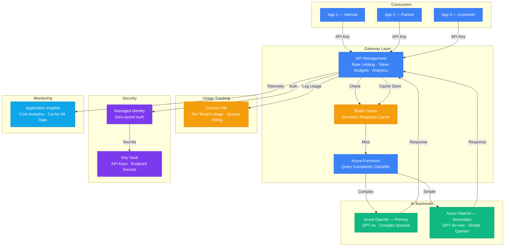

# Architecture — Play 14: Cost-Optimized AI Gateway

## Overview

Centralized API gateway that routes AI requests to the most cost-effective model based on query complexity. Azure API Management provides rate limiting, token budgets, and multi-tenant usage tracking. An Azure Functions classifier determines whether a query needs GPT-4o or can be handled by GPT-4o-mini, while Redis caching eliminates redundant AI calls.

## Architecture Diagram

## Data Flow

1. **Request Ingestion**: Consumer app sends AI request with API key → APIM validates key, checks rate limits, enforces token budget per tenant
2. **Cache Check**: APIM policy checks Redis for semantically similar cached response (embedding similarity > 0.95) → Cache hit returns immediately, saving AI call
3. **Classification**: On cache miss, Azure Functions classifier analyzes query complexity (keyword heuristics + token count + intent detection) → Routes to GPT-4o (complex) or GPT-4o-mini (simple)
4. **Inference**: Selected Azure OpenAI endpoint processes the request → Response streamed back through APIM → Response cached in Redis with configurable TTL (5-60 minutes)
5. **Usage Tracking**: APIM logs token consumption per tenant to Cosmos DB → Quota enforcement checked on next request → Billing aggregation for chargeback
6. **Analytics**: Application Insights dashboards show cost per tenant, model routing split, cache hit rate, and latency percentiles

## Service Roles

| Service | Layer | Role |
|---------|-------|------|
| API Management | Gateway | Central proxy — rate limiting, auth, routing policies |
| Azure Functions | Gateway | Query complexity classifier for model routing |
| Azure Cache for Redis | Gateway | Semantic response caching, deduplication |
| Azure OpenAI (Primary) | AI | GPT-4o for complex reasoning tasks |
| Azure OpenAI (Secondary) | AI | GPT-4o-mini for simple queries at lower cost |
| Cosmos DB | Data | Per-tenant usage tracking, quotas, billing |
| Key Vault | Security | API keys for multiple AI endpoints |
| Application Insights | Monitoring | Cost analytics, routing effectiveness, cache metrics |

## Security Architecture

- **API Key + OAuth**: APIM validates consumer API keys, supports OAuth 2.0 for enterprise consumers
- **Managed Identity**: APIM-to-OpenAI authentication via managed identity — no keys in policies
- **Rate Limiting**: Per-consumer rate limits prevent abuse (requests/min + tokens/day)
- **Token Budgets**: Per-tenant daily/monthly token caps enforced at gateway level
- **Network Isolation**: APIM Premium deployed in VNet with private endpoints to AI backends
- **Audit Trail**: All requests logged with tenant ID, model used, tokens consumed, cost

## Scaling

| Metric | Dev | Production | Enterprise |
|--------|-----|-----------|------------|
| API consumers | 1-3 | 10-50 | 100+ |
| Requests/minute | 50 | 500 | 5,000+ |
| Cache hit rate target | 10% | 30-50% | 40-60% |
| Model routing split | 100% mini | 60% mini / 40% 4o | 70% mini / 30% 4o |
| Token budget/tenant/day | 100K | 1M | 10M |
| Regions | 1 | 1 | 2-3 |
