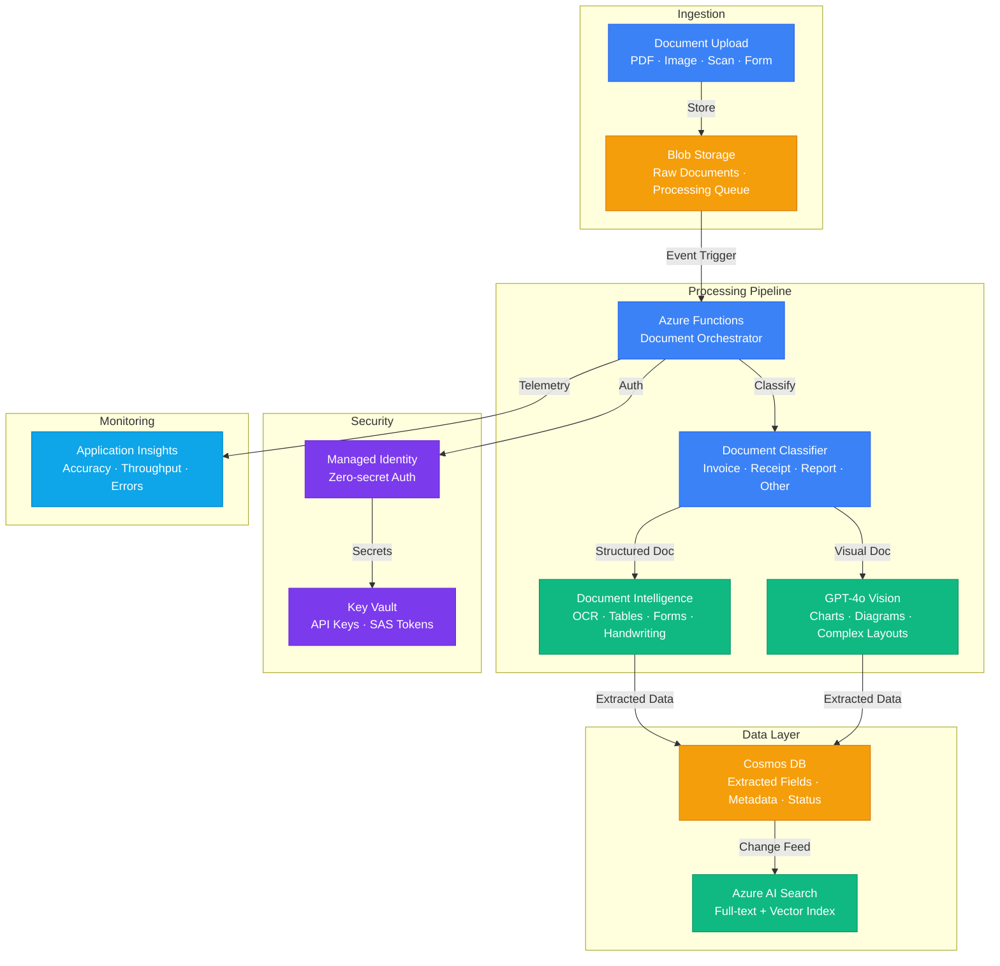

# Architecture — Play 15: Multi-Modal Document Processing

## Overview

Intelligent document processing pipeline combining Azure Document Intelligence for OCR and structured extraction with GPT-4o vision capabilities for complex visual understanding. Documents of any format (scanned PDFs, images, forms, charts) are ingested, classified, extracted, and stored as structured data with full-text and vector search for downstream consumption.

## Architecture Diagram

## Data Flow

1. **Ingestion**: Documents uploaded to Blob Storage via REST API or batch upload → Blob event trigger fires Azure Functions orchestrator → Document queued for processing
2. **Classification**: Orchestrator analyzes document type (MIME type, first-page layout analysis) → Routes to optimal extraction path: structured forms → Document Intelligence, visual content → GPT-4o Vision
3. **OCR Extraction**: Document Intelligence processes structured documents → Extracts tables, key-value pairs, handwriting, checkboxes → Returns structured JSON with confidence scores and bounding boxes
4. **Vision Analysis**: GPT-4o Vision processes complex visual content → Interprets charts, graphs, diagrams, architectural drawings → Returns structured extraction with natural language descriptions
5. **Storage**: Extracted data written to Cosmos DB with document ID, extracted fields, confidence scores, processing metadata → Change feed pushes to AI Search for full-text + vector indexing
6. **Consumption**: Downstream applications query Cosmos DB for structured data or AI Search for semantic search → Processing status tracked for retry on failures

## Service Roles

| Service | Layer | Role |
|---------|-------|------|
| Azure Document Intelligence | AI | OCR, table extraction, form recognition, handwriting |
| Azure OpenAI (GPT-4o) | AI | Vision-based analysis — charts, diagrams, complex layouts |
| Azure AI Search | AI | Full-text + vector search over extracted content |
| Azure Functions | Compute | Processing orchestrator, classification, routing |
| Blob Storage | Data | Raw document storage, processing queue |
| Cosmos DB | Data | Structured extraction results, metadata, status |
| Key Vault | Security | API keys, storage SAS tokens |
| Application Insights | Monitoring | Extraction accuracy, throughput, error tracking |

## Security Architecture

- **Managed Identity**: Functions authenticate to all services without stored credentials
- **Blob SAS Policies**: Time-limited, read-only SAS tokens for document access during processing
- **PII Detection**: Extracted text scanned for PII (SSN, credit cards, addresses) and flagged for redaction
- **Private Endpoints**: Document Intelligence and OpenAI accessed via private link in production
- **Encryption**: Documents encrypted at rest (AES-256) and in transit (TLS 1.2+)
- **RBAC**: Document uploaders get Blob Contributor; processing pipeline uses system-assigned MI

## Scaling

| Metric | Dev | Production | Enterprise |
|--------|-----|-----------|------------|
| Documents/day | 50 | 5,000 | 50,000+ |
| Pages/document (avg) | 5 | 10 | 20+ |
| Concurrent processing | 2 | 20 | 100+ |
| Extraction accuracy target | 85% | 95% | 98%+ |
| Processing time/doc | 10-30s | 5-15s | 3-10s |
| Storage retention | 30 days | 1 year | 7 years (compliance) |
