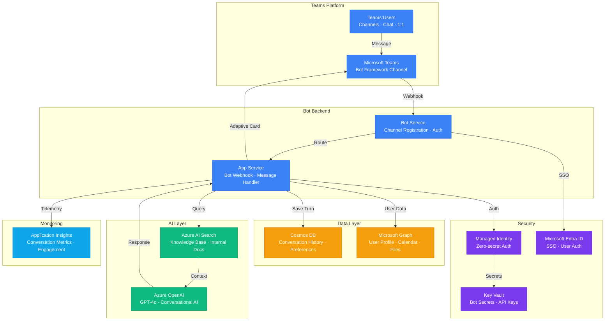

# Architecture — Play 16: Copilot Teams Extension

## Overview

AI-powered Microsoft Teams bot that brings GPT-4o intelligence directly into the Teams workspace. Users interact via natural language in channels, group chats, or 1:1 conversations. The bot retrieves context from organizational knowledge bases via Azure AI Search, maintains multi-turn conversation history in Cosmos DB, and returns grounded answers with adaptive card formatting.

## Architecture Diagram

## Data Flow

1. **User Message**: User sends a message in Teams channel or chat → Teams platform delivers message to Bot Service via webhook → Bot Service routes to App Service backend
2. **Context Retrieval**: App Service loads conversation history from Cosmos DB (last N turns) → Queries Azure AI Search for relevant knowledge base documents → Optionally calls Microsoft Graph for user-specific context (calendar, files)
3. **AI Generation**: Conversation history + retrieved context + system prompt sent to GPT-4o → Model generates grounded response with citations → Content Safety filter validates output
4. **Response Delivery**: App Service formats response as Teams adaptive card (rich formatting, action buttons, citations) → Bot Service sends back through Teams channel → Conversation turn saved to Cosmos DB
5. **Proactive Messaging**: Scheduled triggers or external events can push proactive notifications → Bot Service sends adaptive cards to channels or individual users → Engagement tracked in Application Insights
6. **Analytics**: All conversations logged to Application Insights → Metrics: response time, user satisfaction (thumbs up/down), topics, escalation rate

## Service Roles

| Service | Layer | Role |
|---------|-------|------|
| Azure Bot Service | Platform | Teams channel registration, message routing, auth |
| App Service | Compute | Bot webhook, message handler, card rendering |
| Azure OpenAI (GPT-4o) | AI | Conversational AI, summarization, task completion |
| Azure AI Search | AI | Knowledge base retrieval, grounded answers |
| Cosmos DB | Data | Conversation history, user preferences, session state |
| Microsoft Graph | Data | User profiles, calendar, files, organizational data |
| Key Vault | Security | Bot secrets, OpenAI keys, Graph credentials |
| Microsoft Entra ID | Security | SSO, user authentication, tenant isolation |
| Application Insights | Monitoring | Conversation analytics, engagement, quality metrics |

## Security Architecture

- **SSO via Entra ID**: Users authenticate through Teams SSO — no separate login required
- **Tenant Isolation**: Bot scoped to organization's tenant — no cross-tenant data leakage
- **Managed Identity**: App Service authenticates to OpenAI, Search, Cosmos via MI — no secrets in code
- **Content Filtering**: All AI responses pass through Azure Content Safety before delivery to users
- **Data Residency**: Conversation data stored in tenant's preferred Azure region
- **Audit Logging**: All bot interactions logged with user UPN, timestamps, and response metadata

## Scaling

| Metric | Dev | Production | Enterprise |
|--------|-----|-----------|------------|
| Active users | 10 | 500-2,000 | 10,000+ |
| Messages/day | 100 | 5,000 | 50,000+ |
| Concurrent conversations | 5 | 50-100 | 500+ |
| Knowledge base docs | 100 | 5,000 | 50,000+ |
| Conversation history depth | 5 turns | 20 turns | 50 turns |
| App Service instances | 1 | 2-3 | 5-10 |
