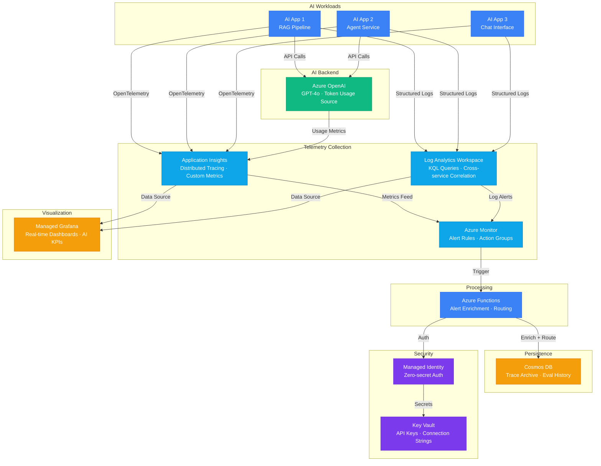

# Architecture — Play 17: AI Observability & Monitoring

## Overview

End-to-end observability stack purpose-built for AI workloads. Captures LLM-specific telemetry (token usage, latency, groundedness scores, model drift) alongside standard application metrics. Application Insights provides distributed tracing, Log Analytics enables KQL-powered investigation, Azure Monitor triggers intelligent alerts, and Managed Grafana delivers real-time dashboards for AI operations teams.

## Architecture Diagram

## Data Flow

1. **Telemetry Emission**: AI applications instrument with OpenTelemetry SDK → Custom spans for LLM calls capture prompt tokens, completion tokens, model version, latency, and groundedness score → Structured logs include correlation IDs linking user request to AI response
2. **Collection & Storage**: Application Insights receives traces and custom metrics → Log Analytics Workspace aggregates structured logs from all services → Token usage, error rates, and latency percentiles computed in near-real-time
3. **Alerting**: Azure Monitor evaluates metric and log-based alert rules → Triggers on anomalies: latency spike > 2x baseline, error rate > 5%, token cost exceeds daily budget → Azure Functions enriches alerts with AI context (recent prompts, model version) and routes to Slack/Teams/PagerDuty
4. **Visualization**: Managed Grafana pulls from Application Insights and Log Analytics → Real-time dashboards show AI KPIs: P95 latency, tokens/request, cost/query, groundedness trend, model drift indicators
5. **Archival**: Azure Functions writes enriched trace data to Cosmos DB for long-term audit → TTL-based cleanup removes data older than retention policy → Historical evaluation trends queryable for compliance reporting

## Service Roles

| Service | Layer | Role |
|---------|-------|------|
| Application Insights | Telemetry | Distributed tracing, custom AI metrics, dependency maps |
| Log Analytics Workspace | Telemetry | Centralized logs, KQL queries, cross-service correlation |
| Azure Monitor | Alerting | Metric alerts, log alerts, action groups, autoscale |
| Managed Grafana | Visualization | Real-time AI dashboards, team sharing, SSO |
| Azure OpenAI | AI | Monitored AI endpoint — source of token/latency telemetry |
| Azure Functions | Processing | Alert enrichment, notification routing, trace archival |
| Cosmos DB | Persistence | Long-term trace storage, evaluation history, audit trail |
| Key Vault | Security | API keys, connection strings for monitoring backends |

## Security Architecture

- **Managed Identity**: All services authenticate via managed identity — no secrets in telemetry pipelines
- **Key Vault**: API keys for external notification services (PagerDuty, Slack webhooks) stored securely
- **RBAC**: Log Analytics Reader role for dashboards, Contributor for alert management only
- **Data Masking**: PII stripped from logs before ingestion — prompt content hashed, user IDs pseudonymized
- **Private Link**: Log Analytics and Application Insights accessible via private endpoints in production
- **Retention Policies**: Data retention aligned to compliance requirements — 30/90/365 day tiers

## Scaling

| Metric | Dev | Production | Enterprise |
|--------|-----|-----------|------------|
| Monitored AI apps | 1-2 | 5-15 | 50+ |
| Log ingestion/day | 500MB | 30GB | 100GB+ |
| Custom metrics | 10 | 50 | 200+ |
| Alert rules | 5 | 20 | 50+ |
| Dashboard viewers | 1-3 | 10-30 | 100+ |
| Trace retention | 7 days | 30 days | 90 days |
