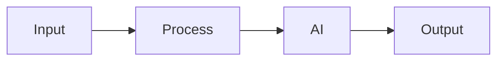

# Solution Play 18: Prompt Management System

> **Complexity:** Medium | **Status:** Skeleton
> Version control, A/B test, and rollback prompts across environments.

## Architecture

## DevKit

Infra: Prompt Flow  Git  GitHub Actions  Azure AI Foundry

| File | Purpose |
|------|---------|
| agent.md | Agent personality |
| instructions.md | System prompts |
| .github/copilot-instructions.md | IDE context |
| .vscode/mcp.json | MCP auto-connect |
| mcp/index.js | Solution tools |
| plugins/ | Reusable functions |

## TuneKit

Tuning: Prompt versions, A/B weights, rollback rules, eval gates

| Config | What |
|--------|------|
| config/openai.json | AI parameters |
| config/guardrails.json | Safety rules |
| infra/main.bicep | Azure resources |
| evaluation/ | Test + scoring |

---

> DevKit builds. TuneKit ships.
