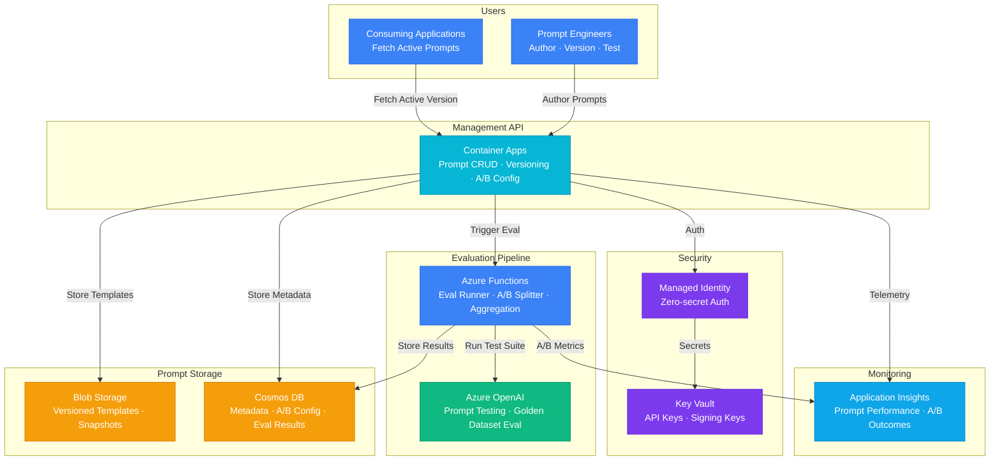

# Architecture — Play 18: Prompt Management & Optimization

## Overview

Version-controlled prompt library with A/B testing and automated evaluation. Teams author, version, and deploy prompt templates through a management API. Each prompt version is evaluated against golden datasets using configurable metrics (groundedness, relevance, coherence). A/B traffic splitting enables safe rollout of new prompts with real-time performance comparison.

## Architecture Diagram

## Data Flow

1. **Authoring**: Prompt engineer creates/updates a template via the management API → Template stored as versioned JSON in Blob Storage (each version is an immutable snapshot) → Metadata (author, tags, A/B config, status) stored in Cosmos DB
2. **Evaluation**: On new version creation, API triggers Azure Functions evaluation pipeline → Functions runs the prompt against a golden dataset (50-200 test cases) using Azure OpenAI → Scores computed: groundedness, relevance, coherence, fluency (1-5 scale) → Results stored in Cosmos DB with version linkage
3. **Promotion**: If eval scores meet thresholds (configurable per prompt), version promoted to "candidate" → A/B traffic split configured (e.g., 90% current / 10% candidate) → Traffic splitting handled at API layer using consistent hashing on user/session ID
4. **Serving**: Consuming applications call the API with a prompt key → API resolves active version (or A/B variant) → Returns rendered template with variable substitution → Response cached in Container Apps memory for hot prompts
5. **Analysis**: Application Insights tracks per-version metrics: latency, token usage, user feedback scores → A/B comparison dashboards show statistical significance → Winner promoted to 100% traffic when confidence threshold met

## Service Roles

| Service | Layer | Role |
|---------|-------|------|
| Container Apps | Compute | Prompt management API, versioning, A/B traffic routing |
| Blob Storage | Storage | Immutable prompt template storage with version snapshots |
| Cosmos DB | Storage | Prompt metadata, A/B configs, evaluation results |
| Azure OpenAI | AI | Prompt evaluation against golden datasets |
| Azure Functions | Compute | Async evaluation pipelines, metric aggregation |
| Key Vault | Security | API keys, prompt signing keys for integrity verification |
| Application Insights | Monitoring | Prompt performance tracking, A/B test analytics |

## Security Architecture

- **Managed Identity**: API-to-storage and API-to-OpenAI auth — no keys in application code
- **Key Vault**: OpenAI API keys and prompt signing keys stored securely with rotation
- **Prompt Signing**: Each published prompt version is signed to detect tampering — verified at serve time
- **RBAC**: Prompt Author (create/edit), Prompt Reviewer (approve/promote), Prompt Reader (fetch only)
- **Audit Trail**: Every version change, promotion, and A/B config update logged in Cosmos DB with user attribution
- **Content Validation**: Prompts scanned for injection patterns before storage

## Scaling

| Metric | Dev | Production | Enterprise |
|--------|-----|-----------|------------|
| Prompt templates | 10-50 | 200-1,000 | 5,000+ |
| Versions per prompt | 5-10 | 50-100 | 500+ |
| Fetch requests/minute | 10 | 500 | 5,000+ |
| Eval runs/day | 1-5 | 20-50 | 200+ |
| A/B experiments active | 1-2 | 5-15 | 50+ |
| Team members | 1-3 | 10-30 | 100+ |
