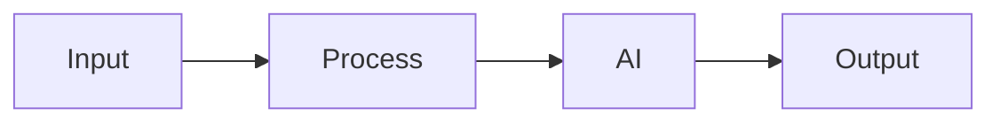

# Solution Play 19: Edge AI with Phi-4

> **Complexity:** High | **Status:** Skeleton
> Deploy Phi-4 on edge devices with ONNX quantization and local serving.

## Architecture

## DevKit

Infra: IoT Hub  Container Instances  ONNX Runtime  Edge Devices

| File | Purpose |
|------|---------|
| agent.md | Agent personality |
| instructions.md | System prompts |
| .github/copilot-instructions.md | IDE context |
| .vscode/mcp.json | MCP auto-connect |
| mcp/index.js | Solution tools |
| plugins/ | Reusable functions |

## TuneKit

Tuning: Quantization level, model config, sync schedule, local cache

| Config | What |
|--------|------|
| config/openai.json | AI parameters |
| config/guardrails.json | Safety rules |
| infra/main.bicep | Azure resources |
| evaluation/ | Test + scoring |

---

> DevKit builds. TuneKit ships.
