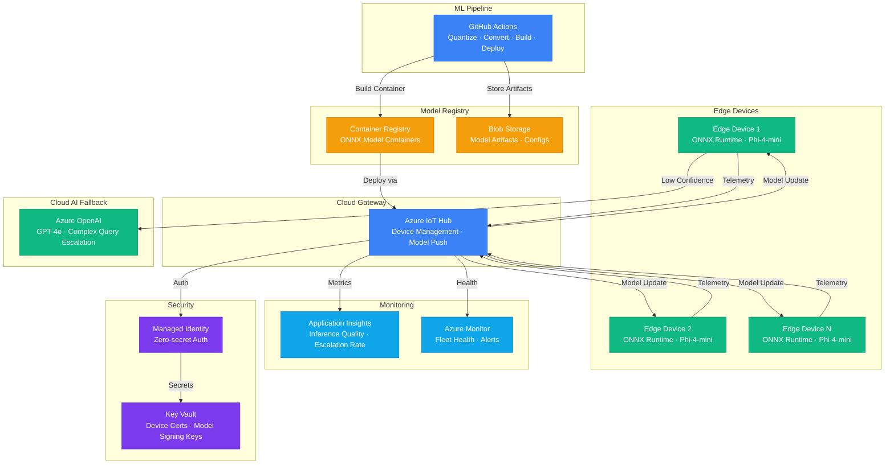

# Architecture — Play 19: Edge AI with Phi-4 Models

## Overview

On-device AI inference using Microsoft Phi-4-mini models optimized with ONNX Runtime for edge deployment. Handles 90%+ of inference locally — no cloud latency, no network dependency, full data privacy. Complex or low-confidence queries escalate to Azure OpenAI cloud endpoints. IoT Hub manages the edge fleet, model updates, and telemetry collection.

## Architecture Diagram

## Data Flow

1. **Model Preparation**: ML pipeline quantizes Phi-4-mini to INT4 using ONNX Runtime quantization tools → Containerized with ONNX Runtime inference server → Container pushed to Azure Container Registry → Model artifacts (configs, tokenizer) stored in Blob Storage
2. **Deployment**: IoT Hub receives deployment manifest referencing ACR container → Pushes model update to target device group (staged rollout: 10% → 50% → 100%) → Edge device pulls container, validates signature, restarts inference service
3. **On-Device Inference**: User query arrives at edge device → ONNX Runtime loads Phi-4-mini INT4 model → Inference runs locally in ~200ms on CPU (or ~50ms with NPU) → Confidence score computed → High-confidence responses returned directly
4. **Cloud Escalation**: Low-confidence queries (score < 0.7) or explicitly complex tasks → Forwarded to Azure OpenAI GPT-4o via secure HTTPS → Cloud response returned to user with "cloud-assisted" flag → Escalation rate tracked for model improvement
5. **Telemetry**: Edge devices batch telemetry every 5 minutes → IoT Hub receives inference latency, accuracy, escalation rate, device health → Application Insights aggregates fleet-wide metrics → Azure Monitor alerts on drift or device failures

## Service Roles

| Service | Layer | Role |
|---------|-------|------|
| ONNX Runtime | Edge | Local model inference engine — CPU/NPU optimized |
| Phi-4-mini (INT4) | Edge | Small language model — 3.8B params quantized to ~2GB |
| Azure IoT Hub | Cloud Gateway | Device management, model deployment, telemetry ingestion |
| Azure Container Registry | Model Registry | Versioned ONNX model containers for edge deployment |
| Blob Storage | Storage | Model artifacts, configs, quantization outputs |
| Azure OpenAI | Cloud AI | Fallback for complex queries — GPT-4o via API |
| GitHub Actions | DevOps | ML pipeline — quantization, conversion, testing, deployment |
| Application Insights | Monitoring | Fleet inference quality, cloud escalation analytics |
| Azure Monitor | Monitoring | Device health, alert rules, fleet status |
| Key Vault | Security | Device certificates, model signing keys |

## Security Architecture

- **Model Signing**: Every model artifact signed before deployment — edge devices verify signature before loading
- **Device Certificates**: X.509 certificates managed via Key Vault — mutual TLS authentication with IoT Hub
- **Data Privacy**: All inference runs on-device — user data never leaves the edge unless explicitly escalated
- **Secure Boot**: Edge devices verify firmware and model integrity at boot time
- **Network Isolation**: Edge-to-cloud communication over TLS 1.3 — IoT Hub private endpoints in enterprise
- **RBAC**: Separate roles for model publishers, device operators, and fleet administrators

## Scaling

| Metric | Dev | Production | Enterprise |
|--------|-----|-----------|------------|
| Edge devices | 1-5 | 50-500 | 5,000+ |
| Inferences/device/day | 100 | 1,000 | 10,000+ |
| Cloud escalation rate | 20-30% | 5-10% | <5% |
| Model size (INT4) | ~2GB | ~2GB | ~2GB |
| Inference latency (CPU) | <500ms | <300ms | <200ms |
| Model update frequency | Weekly | Bi-weekly | Monthly |
