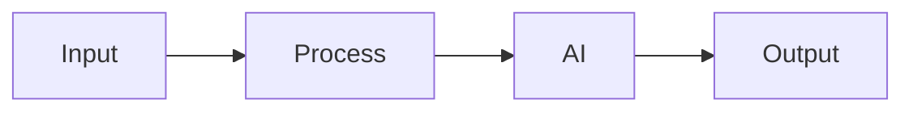

# Solution Play 20: Real-Time Anomaly Detection

> **Complexity:** High | **Status:** Skeleton
> Detect anomalies in real-time streams using Event Hub + AI analysis.

## Architecture

## DevKit

Infra: Event Hub  Stream Analytics  Azure OpenAI  Azure Functions

| File | Purpose |
|------|---------|
| agent.md | Agent personality |
| instructions.md | System prompts |
| .github/copilot-instructions.md | IDE context |
| .vscode/mcp.json | MCP auto-connect |
| mcp/index.js | Solution tools |
| plugins/ | Reusable functions |

## TuneKit

Tuning: Threshold config, alert prompts, detection windows, severity rules

| Config | What |
|--------|------|
| config/openai.json | AI parameters |
| config/guardrails.json | Safety rules |
| infra/main.bicep | Azure resources |
| evaluation/ | Test + scoring |

---

> DevKit builds. TuneKit ships.
