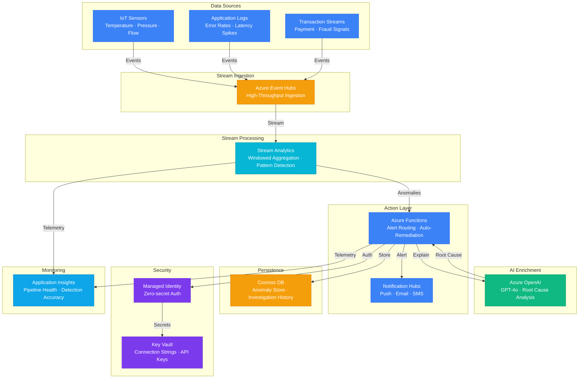

# Architecture — Play 20: Real-Time Anomaly Detection

## Overview

Real-time streaming pipeline that ingests high-volume data streams (sensor data, application logs, financial transactions), applies windowed statistical analysis and pattern detection via Stream Analytics, and enriches detected anomalies with LLM-generated root cause explanations using Azure OpenAI. Azure Functions orchestrates alert routing and auto-remediation workflows.

## Architecture Diagram

## Data Flow

1. **Ingestion**: Data sources (IoT sensors, application logs, transaction systems) emit events to Azure Event Hubs → Event Hubs partitions data by source key for ordered processing → Events buffered with 1-7 day retention for replay capability
2. **Stream Processing**: Stream Analytics consumes from Event Hubs in near-real-time → Applies sliding window aggregations (1min, 5min, 15min) to compute baselines → Tumbling window detects threshold breaches → Temporal pattern matching identifies multi-signal anomalies → Anomalies emitted to output with context snapshot (window stats, contributing signals)
3. **AI Enrichment**: Azure Functions receives anomaly events from Stream Analytics output → Batches anomalies per minute → Sends context to Azure OpenAI GPT-4o → LLM generates root cause hypothesis, severity assessment, and recommended actions → Enriched anomaly stored in Cosmos DB
4. **Action**: Functions evaluates severity → Critical: immediate push notification via Notification Hubs + auto-remediation if playbook exists → Warning: email digest every 15 minutes → Info: logged for trend analysis → All actions recorded in Cosmos DB for audit trail
5. **Investigation**: Operations team queries Cosmos DB for anomaly timeline → Application Insights shows pipeline health (processing lag, detection accuracy, false positive rate) → Historical data enables model tuning and threshold adjustment

## Service Roles

| Service | Layer | Role |
|---------|-------|------|
| Azure Event Hubs | Ingestion | High-throughput stream ingestion, partitioning, retention |
| Azure Stream Analytics | Processing | Real-time windowed aggregation, pattern detection |
| Azure OpenAI | AI | Anomaly explanation, root cause analysis, severity assessment |
| Azure Functions | Orchestration | Alert routing, auto-remediation, anomaly enrichment |
| Cosmos DB | Persistence | Anomaly event store, investigation history, audit trail |
| Notification Hubs | Alerting | Multi-channel alert delivery — push, email, SMS |
| Key Vault | Security | Connection strings, API keys, webhook secrets |
| Application Insights | Monitoring | Pipeline health, detection accuracy, latency tracking |

## Security Architecture

- **Managed Identity**: Stream Analytics, Functions, and Cosmos DB connected via managed identity — no shared keys
- **Key Vault**: Event Hub connection strings and OpenAI API keys stored with automatic rotation
- **Network Isolation**: Event Hubs Premium with private endpoints — no public internet exposure
- **Data Encryption**: All streams encrypted in transit (TLS 1.3) and at rest (service-managed keys)
- **RBAC**: Separate roles for stream operators (read-only), anomaly investigators (read + acknowledge), admins (full access)
- **Audit**: Every anomaly detection, alert, and remediation action logged with timestamp and actor

## Scaling

| Metric | Dev | Production | Enterprise |
|--------|-----|-----------|------------|
| Events/second | 100 | 10,000 | 1,000,000+ |
| Event Hubs throughput units | 1 | 4 | 20+ (or Premium PU) |
| Stream Analytics SU | 1 | 6 | 12-24 |
| Anomalies detected/hour | 5-10 | 50-200 | 1,000+ |
| Alert channels | 1 | 3 | 5+ |
| Data retention | 1 day | 7 days | 30 days |
