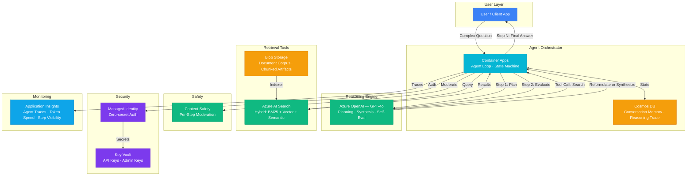

# Architecture — Play 21: Agentic RAG — Autonomous Multi-Step Retrieval

## Overview

Autonomous RAG agent that iteratively retrieves, evaluates, and refines its knowledge before generating an answer. Unlike single-shot RAG (Play 01), the agent plans multi-step retrieval strategies — decomposing complex questions, reformulating queries when initial results are insufficient, cross-referencing across document collections, and self-evaluating answer completeness. Built on Azure OpenAI function calling with AI Search as the primary retrieval tool.

## Architecture Diagram

## Data Flow

1. **Question Intake**: User submits a complex question → Container Apps agent receives request, creates session in Cosmos DB → Agent state machine initializes with question + conversation history
2. **Planning**: Agent sends question to GPT-4o with system prompt containing available tools → GPT-4o decomposes question into sub-queries (e.g., "What is X?" + "How does X relate to Y?") → Returns a retrieval plan as structured function calls
3. **Iterative Retrieval**: For each sub-query, agent calls AI Search with reformulated query → Hybrid search (BM25 + vector + semantic reranking) returns top-5 chunks → Agent evaluates result relevance (score 1-5) → If relevance < 3, agent reformulates query and retries (max 2 retries per sub-query)
4. **Synthesis & Self-Evaluation**: After all sub-queries resolved, agent sends accumulated context to GPT-4o for final synthesis → GPT-4o generates answer with citations → Agent self-evaluates: "Does this answer fully address the original question?" → If incomplete, agent identifies gaps and executes additional retrieval steps
5. **Safety & Response**: Each synthesis step passes through Content Safety → Final answer with citations returned to user → Full reasoning trace (plan → retrievals → evaluations → synthesis) logged to Application Insights → Session state persisted to Cosmos DB for follow-up questions

## Service Roles

| Service | Layer | Role |
|---------|-------|------|
| Container Apps | Orchestration | Agent loop, state machine, tool execution, streaming |
| Azure OpenAI (GPT-4o) | Reasoning | Query planning, synthesis, self-evaluation via function calling |
| Azure AI Search | Retrieval | Hybrid search with iterative query reformulation |
| Cosmos DB | Persistence | Agent session state, conversation memory, reasoning traces |
| Blob Storage | Data | Document corpus, source material for search indexing |
| Content Safety | Safety | Per-step moderation — validates intermediate and final outputs |
| Key Vault | Security | API keys, search admin keys, agent configuration secrets |
| Application Insights | Monitoring | Step-level tracing, token cost per query, retrieval quality |

## Security Architecture

- **Managed Identity**: Agent-to-Search and Agent-to-OpenAI via managed identity — zero secrets in orchestrator code
- **Key Vault**: AI Search admin keys and backup OpenAI keys stored with automatic rotation
- **Per-Step Moderation**: Content Safety validates each intermediate synthesis, not just final output — prevents reasoning chain attacks
- **Tool Sandboxing**: Agent can only call registered tools (search, synthesize) — no arbitrary code execution
- **Session Isolation**: Each agent session scoped to user — no cross-session memory leakage
- **Prompt Injection Defense**: System prompts include injection-resistant framing — user input treated as data, not instructions
- **Private Endpoints**: AI Search and OpenAI behind private endpoints in production

## Scaling

| Metric | Dev | Production | Enterprise |
|--------|-----|-----------|------------|
| Concurrent agent sessions | 5 | 50-200 | 1,000+ |
| Reasoning steps/query | 2-3 | 3-5 | 5-8 |
| Tokens/query (avg) | 2K | 5-8K | 10-15K |
| Search queries/user query | 2-4 | 3-6 | 5-10 |
| Documents indexed | 1K | 100K | 1M+ |
| Container replicas | 1 | 2-4 | 5-15 |
| P95 response time | 10s | 8s | 6s |
