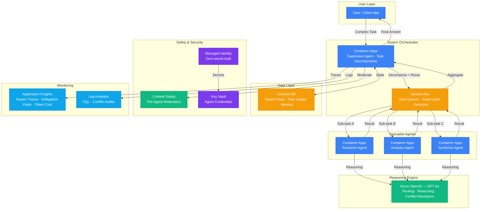

# Architecture — Play 22: Multi-Agent Swarm Orchestration

## Overview

Swarm-based multi-agent system with dynamic delegation. A supervisor agent receives user requests, decomposes complex tasks, and dynamically routes sub-tasks to specialist agents. Agents communicate asynchronously via Service Bus, maintain shared state in Cosmos DB, and resolve conflicts when multiple agents contribute to a single answer. Built on Azure Container Apps with Dapr sidecars for service discovery and pub/sub.

## Architecture Diagram

## Data Flow

1. **Task Intake**: User submits a complex multi-faceted request → Supervisor agent analyzes scope and decomposes into discrete sub-tasks → Each sub-task gets a priority, estimated complexity, and required specialist type
2. **Delegation**: Supervisor publishes sub-tasks to Service Bus topic with session-aware routing → Each specialist agent subscribes to its capability topic → Tasks distributed round-robin with affinity for stateful conversations
3. **Specialist Execution**: Each specialist agent picks up its sub-task → Calls Azure OpenAI (GPT-4o) for reasoning → Writes intermediate results to Cosmos DB task ledger → Returns result to Service Bus completion queue
4. **Conflict Resolution**: Supervisor collects all specialist results → If conflicting answers detected, supervisor invokes GPT-4o with all results for resolution → Merged answer with provenance tracking per specialist
5. **Safety & Response**: Aggregated answer passes through Content Safety → Final response returned to user with attribution → Full delegation tree logged to Application Insights → Swarm state persisted to Cosmos DB for follow-up

## Service Roles

| Service | Layer | Role |
|---------|-------|------|
| Container Apps (Supervisor) | Orchestration | Task decomposition, delegation routing, conflict resolution |
| Container Apps (Specialists) | Compute | Domain-specific agent execution with auto-scaling |
| Azure OpenAI (GPT-4o) | AI | Reasoning engine for all agents — routing, analysis, synthesis |
| Service Bus | Messaging | Async task queues, dead-letter handling, ordered sessions |
| Cosmos DB | Data | Swarm state ledger, task tracking, conversation memory |
| Content Safety | AI | Per-agent output moderation across delegation chain |
| Key Vault | Security | Agent credentials, tool-access tokens |
| Managed Identity | Security | Zero-secret service-to-service authentication |
| Application Insights | Monitoring | Distributed tracing across swarm, delegation path visualization |
| Log Analytics | Monitoring | Centralized logging, KQL alerting, conflict audits |

## Security Architecture

- **Managed Identity**: All agent-to-service communication via managed identity — no shared secrets
- **Agent Isolation**: Each specialist runs in its own container with scoped RBAC permissions
- **Service Bus RBAC**: Agents can only listen on their designated subscriptions — no cross-agent eavesdropping
- **Key Vault**: Per-agent credential scoping — specialists only access tools they need
- **Content Safety**: Per-step moderation validates each specialist's output before aggregation
- **Prompt Injection Defense**: System prompts isolate user input as data — specialists cannot override supervisor instructions
- **Dead-Letter Monitoring**: Failed tasks routed to dead-letter queue with alerts — prevents silent failures

## Scaling

| Metric | Dev | Production | Enterprise |
|--------|-----|-----------|------------|
| Concurrent swarm sessions | 3-5 | 50-200 | 1,000+ |
| Specialist agents | 3 | 5-8 | 10-20 |
| Sub-tasks per request | 2-3 | 3-6 | 5-12 |
| Tokens per swarm session | 3K | 8-15K | 20-40K |
| Messages per minute | 20 | 500 | 5,000+ |
| Container replicas (per agent) | 1 | 2-3 | 3-5 |
| P95 response time | 15s | 12s | 10s |
