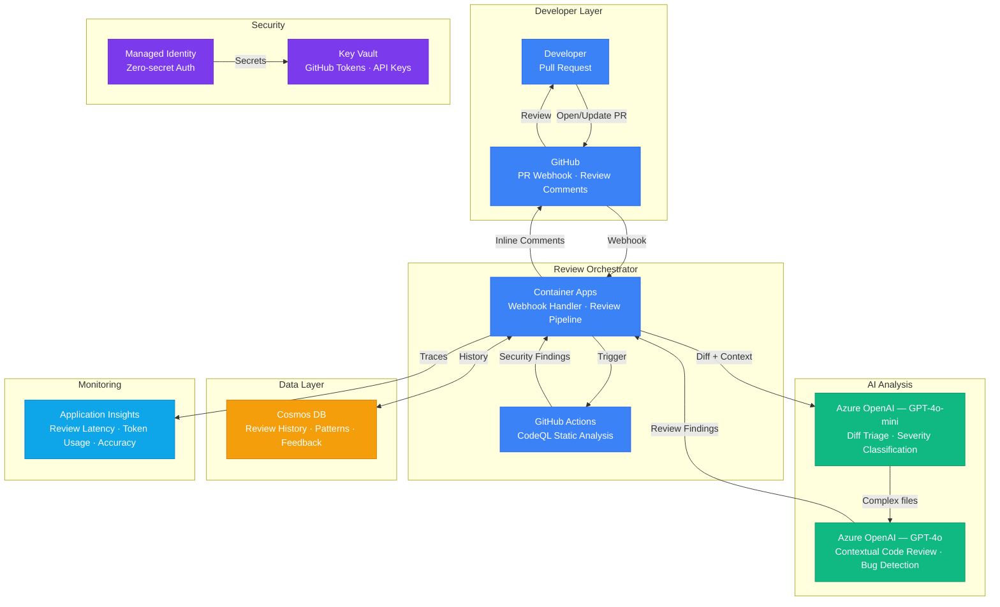

# Play 24 — AI Code Review Pipeline 🔍

> Automated PR review with static analysis, LLM-powered code comments, and merge gates.

AI reviews every pull request automatically. Static analysis catches syntax and style, GPT-4o reviews for security vulnerabilities and logic errors, OWASP scanning catches dependency issues. Actionable comments posted directly to GitHub PR. Critical findings block merge.

## Quick Start
```bash
cd solution-plays/24-ai-code-review-pipeline
# Copy workflow to your repo
cp .github/workflows/ai-code-review.yml YOUR_REPO/.github/workflows/
code .  # Use @builder for pipeline, @reviewer for quality audit, @tuner for FP reduction
```

## Architecture



| Service | Purpose |
|---------|---------|
| GitHub Actions | CI/CD pipeline trigger on PR events |
| Azure OpenAI (gpt-4o + mini) | LLM code review (routed by file type) |
| Static Analysis (ESLint/Pylint) | First-pass syntax and style checks |
| OWASP Dependency Check | Vulnerability scanning on dependencies |
| GitHub PR API | Post review comments to correct lines |

## Review Pipeline
```
PR Created → Changed Files → Static Analysis → LLM Review → Post Comments → Merge Gate
                                    │
    ├── Security files → gpt-4o (OWASP, secrets, injection)
    ├── Logic files → gpt-4o (errors, performance, patterns)
    └── Style/tests → gpt-4o-mini (naming, docs, best practices)
```

## Key Metrics
- Comment actionability: ≥80% · False positive: <15% · Review latency: <3min · OWASP: 100%

## DevKit (Code Review-Focused)
| Primitive | What It Does |
|-----------|-------------|
| 3 agents | Builder (pipeline/prompts/merge gates), Reviewer (FP rate/quality audit), Tuner (prompt optimization/model routing) |
| 3 skills | Deploy (103 lines), Evaluate (105 lines), Tune (101 lines) |
| 4 prompts | `/deploy` (GitHub Actions), `/test` (review pipeline), `/review` (quality audit), `/evaluate` (FP rate) |

**Note:** This is a DevOps/developer tooling play. TuneKit covers review prompt optimization, model routing by file type (security→4o, tests→mini), severity thresholds, false positive reduction strategies, and cost per review (~$0.07/PR) — not AI product quality.

## Cost
| Dev | Prod (50 PRs/day) |
|-----|-------------------|
| $20–50/mo | ~$105/mo ($0.07/PR × 50 × 30) |

📖 [Full docs](spec/README.md) · 🌐 [frootai.dev/solution-plays/24-ai-code-review-pipeline](https://frootai.dev/solution-plays/24-ai-code-review-pipeline)
