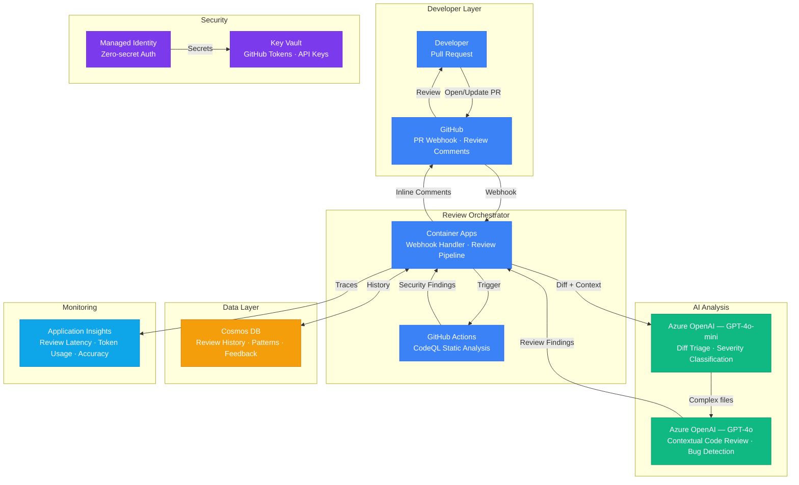

# Architecture — Play 24: AI Code Review

## Overview

Automated code review pipeline combining LLM-powered analysis (GPT-4o) with static analysis (CodeQL). On every pull request, the system analyzes the diff for bugs, security vulnerabilities, performance issues, and style violations. CodeQL handles deterministic security scanning while GPT-4o provides contextual review comments — understanding intent, suggesting refactoring, and explaining why changes matter. Results are posted as inline PR review comments with severity ratings.

## Architecture Diagram

## Data Flow

1. **PR Trigger**: Developer opens or updates a pull request → GitHub sends a webhook event to the Container Apps orchestrator → Orchestrator fetches the full diff, file list, and PR metadata via GitHub API
2. **Triage**: GPT-4o-mini performs initial triage — classifies each changed file by risk (high/medium/low) based on file type, change size, and sensitive patterns (auth, crypto, SQL) → Only high/medium risk files proceed to full LLM review
3. **Parallel Analysis**: CodeQL runs as a GitHub Actions workflow — static analysis for security vulnerabilities, injection flaws, and known CVE patterns → GPT-4o reviews triaged files with surrounding code context (±50 lines) for logic bugs, performance issues, and refactoring opportunities
4. **Finding Merge**: Orchestrator collects CodeQL SARIF results and GPT-4o review comments → De-duplicates overlapping findings → Assigns severity (critical/high/medium/low) and confidence score → Checks Cosmos DB for previously dismissed false positives
5. **Review Posting**: Findings posted as inline PR review comments via GitHub API → Each comment includes: finding description, severity, confidence, suggested fix, and "Dismiss" button for feedback → Review metrics (latency, token cost, finding count) logged to Application Insights

## Service Roles

| Service | Layer | Role |
|---------|-------|------|
| Container Apps | Compute | Webhook handler, review orchestration, finding aggregation |
| GitHub Actions | Compute | CodeQL runner, static analysis execution |
| Azure OpenAI (GPT-4o) | AI | Contextual code review, bug detection, refactoring suggestions |
| Azure OpenAI (GPT-4o-mini) | AI | Diff triage, severity classification, boilerplate filtering |
| GitHub Advanced Security | Security | CodeQL static analysis, dependency scanning, secret scanning |
| Cosmos DB | Data | Review history, false-positive tracking, pattern learning |
| Key Vault | Security | GitHub PAT tokens, OpenAI API keys, webhook secrets |
| Managed Identity | Security | Azure service-to-service auth |
| Application Insights | Monitoring | Review latency, token usage, finding accuracy metrics |

## Security Architecture

- **Webhook Verification**: All GitHub webhooks validated via HMAC-SHA256 signature — prevents spoofed review triggers
- **Scoped GitHub Token**: Review bot uses a fine-grained PAT with minimal permissions (read code, write PR comments only)
- **Code Isolation**: Code diffs processed in memory — never persisted to disk or logged in full
- **Key Vault**: All secrets (GitHub tokens, API keys) stored in Key Vault with automatic rotation
- **Managed Identity**: Container Apps to OpenAI and Cosmos DB via managed identity
- **Content Filtering**: AI-generated review comments pass through content safety — prevents inappropriate or biased language
- **Audit Trail**: All review actions logged with actor, timestamp, and finding disposition

## Scaling

| Metric | Dev | Production | Enterprise |
|--------|-----|-----------|------------|
| PRs reviewed per day | 5-10 | 50-200 | 500+ |
| Files per PR (avg) | 3-5 | 5-15 | 10-30 |
| Findings per PR (avg) | 1-3 | 3-8 | 5-15 |
| Tokens per PR review | 2K | 5-10K | 10-20K |
| Review latency (P95) | 30s | 45s | 60s |
| CodeQL scan time | 2min | 3min | 5min |
| Container replicas | 1 | 1-2 | 2-5 |
