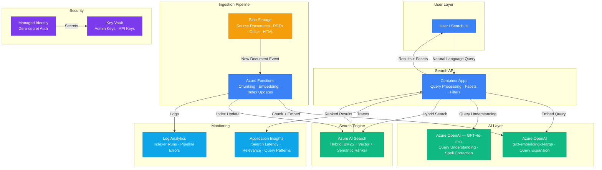

# Architecture — Play 26: Enterprise Semantic Search Engine

## Overview

Enterprise semantic search platform with hybrid retrieval combining BM25 keyword search, vector similarity search, and semantic reranking. Documents are ingested from Blob Storage, chunked, embedded via text-embedding-3-large, and indexed in Azure AI Search. The search API supports natural language queries, faceted navigation, filters, and relevance feedback. An event-driven pipeline automatically processes new documents and updates the index.

## Architecture Diagram

## Data Flow

1. **Document Ingestion**: Documents uploaded to Blob Storage → Event Grid trigger fires Azure Function → Function chunks documents (512 tokens, 10% overlap, respecting paragraph boundaries) → Each chunk embedded via text-embedding-3-large (3072 dimensions) → Chunks + vectors + metadata pushed to AI Search index
2. **Query Processing**: User submits natural language query → Container Apps API receives request → GPT-4o-mini performs query understanding (spell correction, intent detection, synonym expansion) → Refined query embedded via text-embedding-3-large for vector component
3. **Hybrid Search**: AI Search executes three retrieval strategies in parallel: BM25 keyword match, vector cosine similarity, and L2 scoring → Results merged via Reciprocal Rank Fusion (RRF) → Semantic ranker re-scores top candidates for final ranking
4. **Result Enrichment**: Top results enriched with highlighting, facet counts (category, date, source), and relevance scores → Response includes document snippets with keyword highlighting and source metadata
5. **Feedback Loop**: User relevance feedback (click-through, dwell time) logged to Application Insights → Feedback used to tune semantic configuration weights → Indexer pipeline metrics (throughput, errors, latency) tracked in Log Analytics

## Service Roles

| Service | Layer | Role |
|---------|-------|------|
| Container Apps | Compute | Search API gateway, query processing, result enrichment |
| Azure AI Search | Search | Hybrid index, semantic ranker, faceted navigation |
| Azure OpenAI (Embedding) | AI | Document + query embedding via text-embedding-3-large |
| Azure OpenAI (GPT-4o-mini) | AI | Query understanding, spell correction, intent detection |
| Azure Functions | Compute | Event-driven document processing, chunking, index updates |
| Blob Storage | Storage | Source document repository, multi-format support |
| Key Vault | Security | AI Search admin keys, OpenAI API keys |
| Managed Identity | Security | Zero-secret service-to-service authentication |
| Application Insights | Monitoring | Search latency, relevance metrics, query analytics |
| Log Analytics | Monitoring | Indexer pipeline logs, error tracking, throughput |

## Security Architecture

- **Managed Identity**: Container Apps and Functions authenticate to AI Search and OpenAI via managed identity
- **Key Vault**: Admin keys stored in Key Vault with automatic rotation — never in config files
- **Query-Only Access**: Search API uses query keys (read-only) — admin keys only used by indexing pipeline
- **Private Endpoints**: AI Search, Blob Storage, and OpenAI behind private endpoints in production
- **RBAC**: Scoped roles — Functions get Index Contributor, API gets Index Reader
- **Data Classification**: Document metadata includes sensitivity labels — search results filter based on user permissions
- **Input Sanitization**: All search queries sanitized to prevent OData injection in filter expressions

## Scaling

| Metric | Dev | Production | Enterprise |
|--------|-----|-----------|------------|
| Documents indexed | 5K | 500K | 5M+ |
| Queries per minute | 10 | 200 | 2,000+ |
| Index size | 500MB | 50GB | 500GB+ |
| Embedding dimensions | 3072 | 3072 | 3072 |
| Search replicas | 1 | 2 | 3-6 |
| Search partitions | 1 | 1-2 | 3-6 |
| Query latency P95 | 200ms | 150ms | 100ms |
| Indexing throughput | 100 docs/min | 1K docs/min | 10K docs/min |
| Container replicas | 1 | 2-4 | 5-10 |
