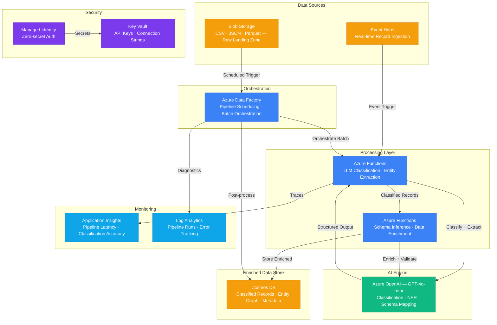

# Architecture — Play 27: AI Data Pipeline

## Overview

LLM-powered data pipeline that classifies, extracts entities from, and enriches streaming and batch data records. Raw data lands in Blob Storage or streams through Event Hubs, gets processed by Azure Functions that call GPT-4o-mini for classification and entity extraction, orchestrated by Data Factory for batch workflows, and stored as enriched records in Cosmos DB. The pipeline handles both real-time streaming enrichment and scheduled batch processing with configurable classification taxonomies.

## Architecture Diagram

## Data Flow

1. **Data Ingestion**: Raw data arrives via two paths — batch files (CSV, JSON, Parquet) land in Blob Storage on a schedule or ad hoc, while real-time records stream through Event Hubs from upstream systems, APIs, or IoT devices
2. **Batch Orchestration**: Azure Data Factory triggers batch pipelines on schedule or blob-arrival events → Reads raw files → Splits into record batches (20-50 records per LLM call) → Fans out to Azure Functions for parallel classification
3. **LLM Classification**: Azure Functions receive record batches → Sends structured prompt to GPT-4o-mini with classification taxonomy and few-shot examples → Model returns category labels, confidence scores, and extracted entities (names, dates, amounts, locations) → Results validated against schema
4. **Data Enrichment**: Classified records pass through enrichment stage → GPT-4o-mini infers missing schema fields, normalizes formats, and resolves entity references → Enriched records validated against output schema → Failed records routed to dead-letter queue
5. **Storage & Serving**: Enriched records written to Cosmos DB with partition key on classification category → Entity relationships stored as nested documents → Pipeline metadata (run ID, timestamp, model version, token usage) attached to each record → Data available for downstream analytics and search

## Service Roles

| Service | Layer | Role |
|---------|-------|------|
| Azure OpenAI (GPT-4o-mini) | AI | Data classification, entity extraction, schema inference |
| Azure Data Factory | Orchestration | Batch pipeline scheduling, workflow management |
| Azure Functions | Compute | Event-triggered classification and enrichment workers |
| Event Hubs | Ingestion | Real-time record streaming from upstream systems |
| Blob Storage | Storage | Raw data landing zone, pre/post enrichment staging |
| Cosmos DB | Data | Enriched record store, entity graph, pipeline metadata |
| Key Vault | Security | API keys, connection strings, SAS tokens |
| Managed Identity | Security | Zero-secret service-to-service authentication |
| Application Insights | Monitoring | Classification accuracy, token usage, pipeline latency |
| Log Analytics | Monitoring | Pipeline run history, error diagnostics |

## Security Architecture

- **Managed Identity**: Functions and Data Factory authenticate to OpenAI, Cosmos DB, and Event Hubs via managed identity
- **Key Vault**: All connection strings and API keys stored in Key Vault — never in pipeline definitions
- **Data Classification**: Pipeline itself classifies data sensitivity levels — PII records tagged and routed to encrypted containers
- **Network Isolation**: Event Hubs, Cosmos DB, and Storage behind private endpoints in production
- **RBAC**: Data Factory gets Pipeline Contributor, Functions get Cosmos DB Data Contributor — least privilege
- **Audit Trail**: Every classification decision logged with model version, prompt hash, and confidence score
- **Input Validation**: All raw records validated against expected schema before LLM processing — malformed records rejected

## Scaling

| Metric | Dev | Production | Enterprise |
|--------|-----|-----------|------------|
| Records processed/day | 1K | 100K | 5M+ |
| Classification latency P95 | 2s | 1.5s | 1s |
| Batch pipeline runs/day | 2 | 24 | 144 (every 10 min) |
| Event Hubs throughput | 1 TU | 4 TUs | 16 PUs |
| Functions concurrency | 5 | 50 | 200+ |
| Cosmos DB partitions | 1 | 10 | 50+ |
| Token usage/day | 100K | 2M | 20M+ |
| Classification accuracy | 85% | 92% | 95%+ |
| Container replicas | — | — | — |
