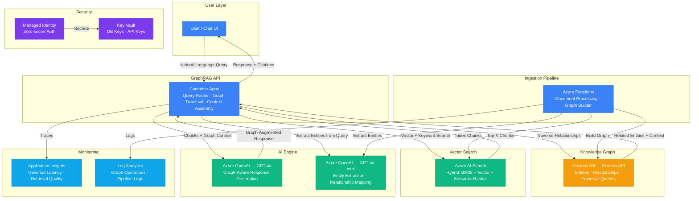

# Architecture — Play 28: Knowledge Graph RAG

## Overview

Graph-enhanced RAG system that combines traditional vector retrieval with knowledge graph traversal for richer, more contextual answers. Documents are ingested and chunked for AI Search (vector + keyword), while entities and relationships are extracted by GPT-4o and stored in Cosmos DB Gremlin API as a knowledge graph. At query time, the system performs hybrid search to find relevant chunks, then traverses the knowledge graph to discover related entities and contextual connections, assembling a graph-augmented context window for response generation.

## Architecture Diagram

## Data Flow

1. **Document Ingestion**: New documents uploaded → Azure Functions chunk documents (512 tokens, 10% overlap) → Each chunk embedded via text-embedding-3-large and indexed in AI Search → Simultaneously, GPT-4o-mini extracts entities (people, organizations, concepts, dates) and relationships (reports-to, related-to, depends-on) from each chunk
2. **Graph Construction**: Extracted entities become vertices in Cosmos DB Gremlin graph → Relationships become labeled edges with properties (confidence score, source document, extraction date) → Duplicate entities merged via fuzzy name matching and coreference resolution → Graph maintains provenance links back to source chunks
3. **Query Processing**: User submits natural language query → API performs hybrid search on AI Search (BM25 + vector) to retrieve top-K relevant chunks → GPT-4o-mini extracts key entities from the query → These entities are used as graph entry points
4. **Graph Traversal**: Starting from query entities, Gremlin traversal walks 1-3 hops to discover related entities, sibling relationships, and contextual connections → Traversal results ranked by edge confidence and hop distance → Top graph context combined with vector search chunks to form an enriched context window
5. **Response Generation**: Assembled context (vector chunks + graph relationships + entity metadata) sent to GPT-4o → Model generates response with awareness of entity relationships, providing richer answers with citations to both documents and graph connections → Response includes entity relationship visualization data

## Service Roles

| Service | Layer | Role |
|---------|-------|------|
| Container Apps | Compute | GraphRAG API, query routing, graph traversal orchestration |
| Cosmos DB (Gremlin API) | Knowledge Graph | Entity/relationship storage, graph traversal queries |
| Azure AI Search | Vector Search | Hybrid document retrieval, semantic ranking |
| Azure OpenAI (GPT-4o) | AI | Graph-augmented response generation |
| Azure OpenAI (GPT-4o-mini) | AI | Entity extraction, relationship mapping |
| Azure Functions | Compute | Document ingestion, graph construction pipeline |
| Key Vault | Security | Database keys, API keys, connection strings |
| Managed Identity | Security | Zero-secret service-to-service authentication |
| Application Insights | Monitoring | Traversal latency, retrieval quality, accuracy metrics |
| Log Analytics | Monitoring | Graph operations, ingestion pipeline diagnostics |

## Security Architecture

- **Managed Identity**: Container Apps and Functions authenticate to Cosmos DB, AI Search, and OpenAI via managed identity
- **Key Vault**: Gremlin connection keys and API secrets stored in Key Vault with automatic rotation
- **Graph Access Control**: Read-only graph access for query path — write access restricted to ingestion pipeline
- **Private Endpoints**: Cosmos DB, AI Search, and OpenAI behind private endpoints in production
- **RBAC**: Functions get Cosmos DB Data Contributor for graph writes, API gets Data Reader for traversal
- **Data Provenance**: Every graph edge stores source document ID and extraction confidence — traceable audit trail
- **Query Depth Limits**: Gremlin traversal capped at 3 hops and 500 vertices per query — prevents resource exhaustion

## Scaling

| Metric | Dev | Production | Enterprise |
|--------|-----|-----------|------------|
| Graph vertices | 1K | 100K | 1M+ |
| Graph edges | 5K | 500K | 10M+ |
| Documents indexed | 500 | 50K | 500K+ |
| Queries per minute | 5 | 100 | 1,000+ |
| Graph traversal P95 | 200ms | 100ms | 80ms |
| Vector search P95 | 150ms | 100ms | 70ms |
| End-to-end latency P95 | 3s | 2s | 1.5s |
| Cosmos DB RU/s | Serverless | 2,000 | 8,000+ |
| Container replicas | 1 | 2-4 | 5-10 |
