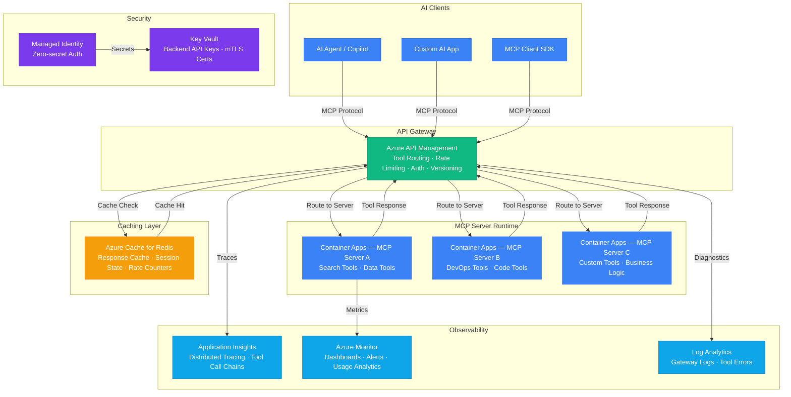

# Architecture — Play 29: Centralized MCP Gateway

## Overview

Centralized Model Context Protocol (MCP) gateway that provides a unified API management layer for tool discovery, routing, and invocation across multiple MCP servers. Azure API Management handles authentication, rate limiting, and request transformation, while Container Apps hosts the MCP server runtimes. The gateway supports tool registration, versioning, health checking, and response caching — enabling AI agents to discover and invoke tools through a single managed endpoint with full observability.

## Architecture Diagram

## Data Flow

1. **Tool Discovery**: AI client connects to APIM gateway endpoint → Sends MCP `tools/list` request → APIM aggregates tool manifests from all registered MCP servers → Returns unified tool catalog with descriptions, input schemas, and version metadata → Client caches catalog locally
2. **Tool Invocation**: Client sends MCP `tools/call` request with tool name and arguments → APIM routes to correct MCP server based on tool registry → Rate limiting and quota checks applied per client/subscription → Request transformed if needed (header injection, auth token swap) → Forwarded to Container Apps MCP server
3. **Response Caching**: APIM checks Redis for cached response (keyed on tool name + argument hash) → Cache hit returns immediately without backend call → Cache miss forwards to MCP server → Response cached with configurable TTL (default 5 min for idempotent tools, no cache for stateful tools)
4. **Server-Sent Events**: For streaming tool responses, APIM proxies SSE connection directly to MCP server → Container Apps maintains persistent connection → Events streamed through APIM with buffering disabled → Client receives incremental results as they are produced
5. **Observability**: Every tool call traced end-to-end via Application Insights correlation IDs → APIM logs request/response metadata (sans sensitive data) to Log Analytics → Azure Monitor dashboards show tool popularity, latency percentiles, error rates, and cache hit ratios → Alerts on error rate spikes or latency degradation

## Service Roles

| Service | Layer | Role |
|---------|-------|------|
| Azure API Management | Gateway | Tool routing, rate limiting, auth, versioning, caching policies |
| Container Apps (Server A) | Runtime | Search and data tools MCP server |
| Container Apps (Server B) | Runtime | DevOps and code tools MCP server |
| Container Apps (Server C) | Runtime | Custom business logic tools MCP server |
| Azure Cache for Redis | Caching | Tool response cache, session state, rate limit counters |
| Key Vault | Security | Backend API keys, mTLS certificates, subscription keys |
| Managed Identity | Security | Zero-secret auth between APIM and MCP servers |
| Application Insights | Monitoring | Distributed tracing, tool call dependency maps |
| Azure Monitor | Monitoring | Dashboards, alerts, usage analytics |
| Log Analytics | Monitoring | Gateway diagnostics, error tracking |

## Security Architecture

- **APIM Authentication**: OAuth 2.0 / API key per client — subscription keys scoped to tool subsets
- **Managed Identity**: APIM authenticates to backend MCP servers via managed identity — no shared secrets
- **Key Vault**: Backend service API keys and mTLS certificates stored in Key Vault with automatic rotation
- **Rate Limiting**: Per-client rate limits prevent abuse — configurable by subscription tier (e.g., 100/min free, 1000/min premium)
- **Input Validation**: APIM validates tool call arguments against JSON schema before forwarding — blocks malformed requests
- **Private Endpoints**: MCP server Container Apps not publicly accessible — only reachable via APIM internal VNet
- **Audit Logging**: All tool invocations logged with client identity, tool name, and timestamp — no argument values in logs (PII risk)
- **mTLS**: Optional mutual TLS between APIM and high-security MCP servers for defense-in-depth

## Scaling

| Metric | Dev | Production | Enterprise |
|--------|-----|-----------|------------|
| Registered tools | 10 | 50 | 200+ |
| MCP servers | 1 | 3-5 | 10-20 |
| Tool calls per minute | 10 | 500 | 5,000+ |
| Cache hit rate | 30% | 50% | 60%+ |
| Gateway latency P95 | 50ms | 30ms | 20ms |
| Tool execution P95 | 2s | 1s | 500ms |
| Concurrent connections | 5 | 100 | 1,000+ |
| SSE streams | 2 | 20 | 200+ |
| Container replicas (per server) | 1 | 2-3 | 3-5 |
