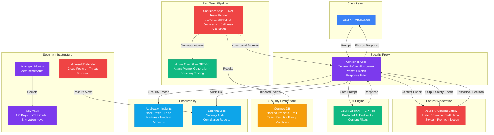

# Architecture — Play 30: AI Security Hardening

## Overview

Comprehensive AI security platform that combines content safety moderation, prompt injection defense, and automated red teaming. All AI interactions pass through a security proxy that enforces content safety policies (hate, violence, self-harm, sexual content, prompt injection) via Azure AI Content Safety. An automated red team pipeline continuously probes the AI system with adversarial prompts to discover vulnerabilities, while a security event store maintains a full audit trail. The system implements defense-in-depth with layered moderation — keyword blocklists, Content Safety API, Prompt Shields, and output filtering.

## Architecture Diagram

## Data Flow

1. **Inbound Moderation**: User sends prompt to security proxy → Proxy applies keyword blocklist (fast, O(1) lookup) → If not blocked, prompt sent to Azure AI Content Safety for multi-category analysis (hate, violence, self-harm, sexual) → Prompt Shields checks for prompt injection and jailbreak attempts → Pass/block decision returned with severity scores per category
2. **Protected AI Call**: Approved prompts forwarded to Azure OpenAI with content filters enabled at the model level → OpenAI generates response with built-in safety system message → Response returned to security proxy for output validation
3. **Outbound Moderation**: AI response passes through Content Safety again for output filtering → Checks for hallucinated harmful content, PII leakage, and policy violations → Clean response delivered to user → Blocked or modified responses logged with reason codes
4. **Red Team Pipeline**: Automated red team runner generates adversarial prompts via GPT-4o (jailbreak attempts, prompt injection, harmful content probes) → Sends attack prompts through the full security proxy pipeline → Records results: which attacks were blocked, which penetrated, severity assessment → Generates vulnerability report with recommended policy updates
5. **Audit & Compliance**: Every moderation decision logged to Cosmos DB (prompt hash, category scores, decision, timestamp) → No raw PII stored — prompts hashed for audit → Log Analytics aggregates security metrics for compliance reporting → Microsoft Defender monitors cloud posture and alerts on misconfiguration

## Service Roles

| Service | Layer | Role |
|---------|-------|------|
| Container Apps (Proxy) | Security | Content safety middleware, prompt shield enforcement |
| Azure AI Content Safety | Moderation | Multi-category content analysis, Prompt Shields |
| Azure OpenAI (GPT-4o) | AI | Protected AI endpoint with content filters |
| Container Apps (Red Team) | Testing | Adversarial prompt generation, jailbreak simulation |
| Cosmos DB | Data | Security event store, audit log, red team results |
| Key Vault | Security | API keys, encryption keys, mTLS certificates |
| Managed Identity | Security | Zero-secret service-to-service authentication |
| Microsoft Defender | Security | Cloud security posture, threat detection |
| Application Insights | Monitoring | Block rates, false positive tracking, injection metrics |
| Log Analytics | Monitoring | Security audit logs, compliance reporting |

## Security Architecture

- **Defense in Depth**: Four moderation layers — keyword blocklist → Content Safety API → Prompt Shields → model-level content filters
- **Managed Identity**: All service-to-service auth via managed identity — proxy to OpenAI, Content Safety, and Cosmos DB
- **Prompt Shields**: Detects both direct injection (user prompt) and indirect injection (grounding documents) attacks
- **Custom Blocklists**: Organization-specific blocked terms and patterns maintained in Content Safety service
- **PII Protection**: Prompts hashed (SHA-256) before storage in audit log — no raw user content persisted
- **Red Team Isolation**: Red team runner operates in a separate Container Apps environment — network-isolated from production
- **Key Rotation**: All API keys and certificates in Key Vault with automatic rotation policies
- **Compliance**: 1-year audit log retention in Log Analytics for SOC 2, ISO 27001, and EU AI Act compliance
- **Severity Thresholds**: Configurable per category — block at severity ≥ 4 (of 6), warn at ≥ 2

## Scaling

| Metric | Dev | Production | Enterprise |
|--------|-----|-----------|------------|
| Moderation checks/minute | 10 | 500 | 5,000+ |
| Content Safety latency P95 | 100ms | 80ms | 60ms |
| Red team prompts/sweep | 50 | 500 | 5,000+ |
| Red team frequency | Manual | Nightly | Continuous |
| Block rate (expected) | 2-5% | 1-3% | 1-3% |
| False positive rate | < 5% | < 2% | < 1% |
| Audit log retention | 7 days | 30 days | 1 year |
| Security event store size | 100MB | 10GB | 100GB+ |
| Proxy replicas | 1 | 2-4 | 5-10 |
