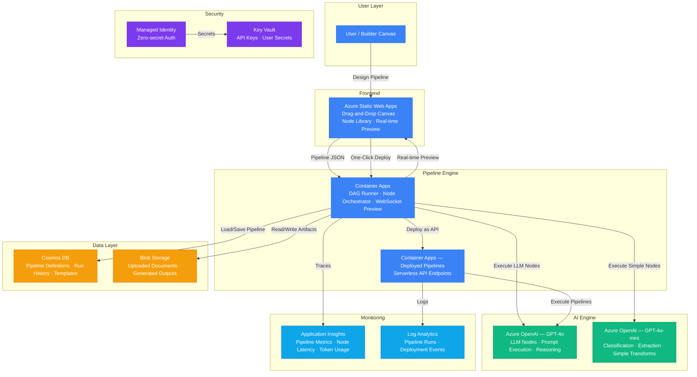

# Architecture — Play 31: Low-Code AI Builder

## Overview

Visual AI pipeline builder that enables users to design, test, and deploy AI workflows through a drag-and-drop canvas. Users compose pipelines from a library of pre-built nodes (LLM prompt, classifier, extractor, transformer, conditional, webhook) on a React-based canvas hosted on Static Web Apps. The pipeline execution engine on Container Apps interprets the visual DAG, orchestrates node execution via Azure OpenAI, stores pipeline definitions and run history in Cosmos DB, and supports one-click deployment of pipelines as serverless API endpoints.

## Architecture Diagram

## Data Flow

1. **Pipeline Design**: User opens the visual builder on Static Web Apps → Drags nodes from the library (LLM prompt, classifier, extractor, conditional branch, webhook, data transform) onto the canvas → Connects nodes with edges to define data flow → Configures each node (prompt template, model selection, output schema) → Pipeline saved as a JSON DAG to Cosmos DB
2. **Real-time Preview**: User clicks "Preview" → Pipeline JSON sent to Container Apps engine via WebSocket → Engine executes the DAG node-by-node with sample data → Each node's output streamed back to the canvas in real-time → User sees intermediate results at every node, enabling iterative prompt tuning
3. **Node Execution**: Engine processes DAG in topological order → LLM nodes send prompts to Azure OpenAI (GPT-4o for complex reasoning, GPT-4o-mini for classification/extraction) → Conditional nodes evaluate expressions to determine branch paths → Transform nodes apply data mapping/filtering → Webhook nodes call external APIs → Each node execution logged with latency, token usage, and output
4. **One-Click Deploy**: User clicks "Deploy" → Engine packages pipeline JSON + node configs into a deployable artifact → Creates a new Container Apps revision with the pipeline as a serverless REST endpoint → Generates API key and endpoint URL → User receives the endpoint URL, ready for integration
5. **Execution & Monitoring**: Deployed pipelines receive API calls → Container Apps auto-scales based on request volume → Pipeline runs logged to Cosmos DB with full execution trace → Application Insights tracks per-node latency, token consumption, and error rates → Users view run history and metrics in the builder dashboard

## Service Roles

| Service | Layer | Role |
|---------|-------|------|
| Azure Static Web Apps | Frontend | Visual pipeline builder, drag-and-drop canvas, node library |
| Container Apps (Engine) | Compute | DAG execution engine, WebSocket preview, pipeline orchestration |
| Container Apps (Deployed) | Compute | Serverless API endpoints for deployed pipelines |
| Azure OpenAI (GPT-4o) | AI | Complex LLM node execution, reasoning, generation |
| Azure OpenAI (GPT-4o-mini) | AI | Simple classification, extraction, transform nodes |
| Cosmos DB | Data | Pipeline definitions, run history, node templates, user workspaces |
| Blob Storage | Storage | Uploaded documents, generated outputs, pipeline artifacts |
| Key Vault | Security | API keys, user connection secrets, pipeline encryption |
| Managed Identity | Security | Zero-secret service-to-service authentication |
| Application Insights | Monitoring | Pipeline metrics, node latency, token usage tracking |
| Log Analytics | Monitoring | Pipeline run logs, deployment events, user activity |

## Security Architecture

- **Managed Identity**: Engine and deployed pipelines authenticate to OpenAI, Cosmos DB, and Blob Storage via managed identity
- **Key Vault**: All API keys and user-provided secrets stored in Key Vault — referenced by name in pipeline definitions, never inline
- **User Isolation**: Pipeline definitions and execution data partitioned by user ID in Cosmos DB — no cross-user data access
- **API Key Auth**: Deployed pipeline endpoints secured with auto-generated API keys — rotatable from the builder UI
- **Input Validation**: Pipeline JSON validated against schema before execution — malformed or oversized pipelines rejected
- **Token Budgets**: Per-pipeline and per-node token limits enforced — prevents runaway LLM costs from loops or large inputs
- **RBAC**: Users get Pipeline Contributor on their workspace — admins get full access for shared templates
- **Content Safety**: Optional Content Safety integration on LLM nodes — configurable per-pipeline

## Scaling

| Metric | Dev | Production | Enterprise |
|--------|-----|-----------|------------|
| Pipelines created | 10 | 500 | 5,000+ |
| Pipeline runs/day | 20 | 2,000 | 50,000+ |
| Nodes per pipeline | 5 | 15 | 30+ |
| Concurrent previews | 2 | 20 | 100+ |
| Deployed endpoints | 2 | 50 | 500+ |
| Pipeline execution P95 | 5s | 3s | 2s |
| Canvas load time | 2s | 1.5s | 1s |
| Token budget per pipeline | 10K | 50K | 200K |
| Engine replicas | 1 | 2-4 | 5-10 |
