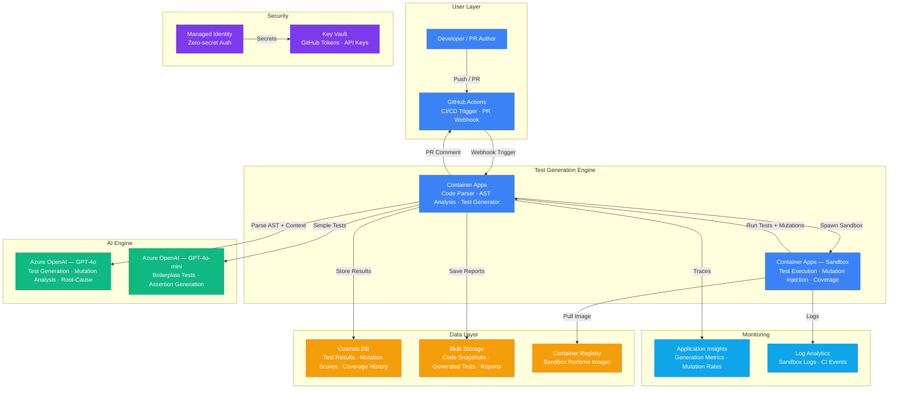

# Architecture — Play 32: AI-Powered Testing

## Overview

AI-powered test generation and mutation testing platform that integrates into CI/CD pipelines via GitHub Actions. The engine parses source code on Container Apps, sends code context to Azure OpenAI for intelligent test generation (unit, integration, edge cases), then executes mutation testing by injecting code mutations and verifying test suite resilience. Results — mutation scores, coverage gaps, and generated test files — are stored in Cosmos DB and surfaced as PR comments and dashboards. Supports TypeScript, Python, C#, Java, and Go via containerized sandbox runtimes.

## Architecture Diagram

## Data Flow

1. **CI Trigger**: Developer pushes code or opens a PR → GitHub Actions workflow fires → Sends webhook with changed files and diff context to the Container Apps test generation engine
2. **Code Analysis**: Engine parses source code into AST → Identifies functions, classes, and methods lacking test coverage → Extracts code context (signatures, dependencies, docstrings, neighboring tests) → Builds generation prompts with code structure and existing test patterns
3. **Test Generation**: Engine sends prompts to Azure OpenAI — GPT-4o for complex integration tests and edge-case reasoning, GPT-4o-mini for simple unit tests and assertion boilerplate → Generated tests validated for syntax correctness → Tests deduplicated against existing test suite
4. **Mutation Testing**: Engine injects code mutations (operator swaps, boundary changes, null insertions, return value modifications) into source code → Runs full test suite in containerized sandbox against each mutant → Calculates mutation score (killed / total mutants) → Identifies surviving mutants indicating weak test assertions
5. **Reporting**: Results stored in Cosmos DB with per-function mutation scores and coverage deltas → Generated test files saved to Blob Storage → Engine posts PR comment with mutation score, coverage improvement, and suggested tests → Dashboard shows trends over time per repository

## Service Roles

| Service | Layer | Role |
|---------|-------|------|
| GitHub Actions | CI/CD | PR trigger, workflow orchestration, result comments |
| Container Apps (Engine) | Compute | Code parsing, AST analysis, prompt construction, test generation |
| Container Apps (Sandbox) | Compute | Isolated test execution, mutation injection, coverage measurement |
| Azure OpenAI (GPT-4o) | AI | Complex test generation, mutation analysis, root-cause reasoning |
| Azure OpenAI (GPT-4o-mini) | AI | Boilerplate unit tests, simple assertion generation |
| Container Registry | Compute | Language-specific sandbox runtime images (Node, Python, .NET, JVM, Go) |
| Cosmos DB | Data | Test results, mutation scores, coverage history, repository metadata |
| Blob Storage | Storage | Code snapshots, generated test files, HTML coverage reports |
| Key Vault | Security | GitHub PATs, OpenAI API keys, webhook secrets |
| Managed Identity | Security | Zero-secret service-to-service authentication |
| Application Insights | Monitoring | Generation latency, mutation detection rates, token usage |
| Log Analytics | Monitoring | Sandbox execution logs, CI pipeline events |

## Security Architecture

- **Managed Identity**: Engine authenticates to OpenAI, Cosmos DB, and Blob Storage via managed identity — no secrets in code
- **Key Vault**: GitHub tokens and webhook secrets stored in Key Vault — rotated automatically
- **Sandbox Isolation**: Each test execution runs in an ephemeral container with no network access to production resources
- **Code Scope**: Engine only processes files in the PR diff — never clones or stores full repository contents
- **RBAC**: Engine service principal gets Cosmos DB Data Contributor and Storage Blob Data Contributor — least privilege
- **Webhook Verification**: GitHub webhook payloads validated with HMAC signature before processing
- **Token Budgets**: Per-PR token limits prevent cost spikes from massive diffs or monorepo sweeps

## Scaling

| Metric | Dev | Production | Enterprise |
|--------|-----|-----------|------------|
| Repositories | 3 | 50 | 500+ |
| PRs analyzed/day | 5 | 200 | 5,000+ |
| Tests generated/PR | 5 | 20 | 50+ |
| Mutations per run | 20 | 100 | 500+ |
| Mutation score target | 60% | 80% | 90%+ |
| Generation P95 latency | 15s | 10s | 5s |
| Sandbox execution P95 | 30s | 20s | 10s |
| Concurrent sandboxes | 2 | 10 | 50+ |
| Engine replicas | 1 | 2-4 | 5-10 |
