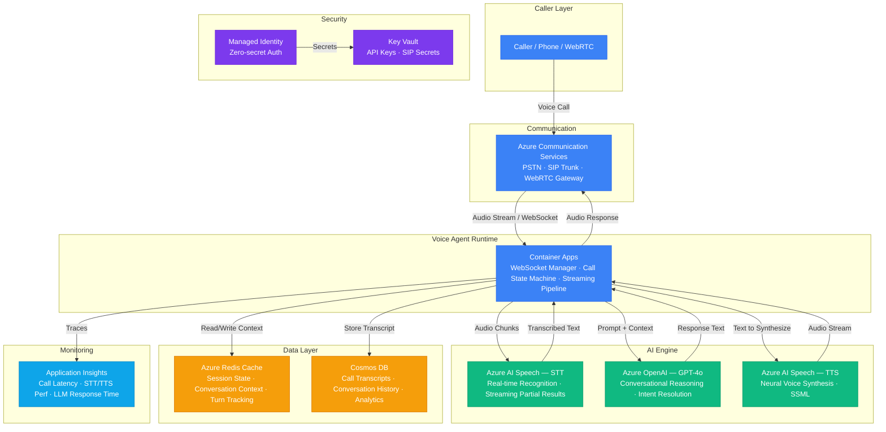

# Architecture — Play 33: Voice AI Agent

## Overview

Conversational voice AI agent that handles real-time phone calls with natural speech interaction. Inbound/outbound calls connect through Azure Communication Services (PSTN/SIP/WebRTC), where audio streams through a low-latency STT→LLM→TTS pipeline on Container Apps. Azure AI Speech converts caller speech to text in real-time, Azure OpenAI processes the conversation with multi-turn context from Redis, and synthesized speech responses stream back to the caller. Cosmos DB stores full call transcripts and analytics. Supports call transfer, DTMF input, barge-in detection, and human escalation.

## Architecture Diagram

## Data Flow

1. **Call Ingestion**: Caller dials a phone number or connects via WebRTC → Azure Communication Services receives the call, establishes a media session → Audio stream forwarded to the Container Apps voice agent via WebSocket with bidirectional audio channels
2. **Speech Recognition**: Voice agent streams audio chunks to Azure AI Speech STT in real-time → STT returns streaming partial results (enables early LLM processing) and final transcriptions → Barge-in detection: if caller interrupts, TTS playback is cancelled and new STT session begins immediately
3. **Conversational AI**: Agent loads conversation context from Redis (previous turns, caller profile, intent history) → Constructs prompt with system instructions, conversation history, and current utterance → Azure OpenAI GPT-4o generates contextual response with action directives (respond, transfer, escalate, collect DTMF) → Response parsed for text content and any control actions
4. **Speech Synthesis**: Response text sent to Azure AI Speech TTS with SSML formatting (prosody, emphasis, pauses) → Neural voice audio streamed back through the agent to Communication Services → Caller hears natural-sounding response within 1-2 seconds of finishing their utterance
5. **State & Analytics**: Each turn (caller utterance + agent response) stored in Redis for active session context → On call completion, full transcript written to Cosmos DB with metadata (duration, turns, intents, sentiment) → Application Insights tracks end-to-end latency per turn, STT/TTS performance, and LLM token usage

## Service Roles

| Service | Layer | Role |
|---------|-------|------|
| Azure Communication Services | Communication | PSTN/SIP/WebRTC voice connectivity, call routing, media sessions |
| Container Apps | Compute | Voice agent runtime, WebSocket session manager, STT→LLM→TTS pipeline |
| Azure AI Speech (STT) | AI | Real-time speech recognition, streaming partial results, language detection |
| Azure OpenAI (GPT-4o) | AI | Multi-turn conversational reasoning, intent resolution, response generation |
| Azure AI Speech (TTS) | AI | Neural voice synthesis, SSML rendering, prosody control |
| Azure Redis Cache | Data | Active call session state, conversation context window, turn tracking |
| Cosmos DB | Data | Call transcripts, conversation history, analytics, agent knowledge base |
| Key Vault | Security | Speech API keys, OpenAI credentials, SIP trunk secrets |
| Managed Identity | Security | Zero-secret authentication across all Azure services |
| Application Insights | Monitoring | Call latency, STT/TTS performance, LLM response time, conversation quality |

## Security Architecture

- **Managed Identity**: Voice agent authenticates to OpenAI, Speech, Cosmos DB, and Redis via managed identity
- **Key Vault**: SIP trunk credentials and any partner API keys stored in Key Vault — never in environment variables
- **Call Encryption**: All audio streams encrypted in transit (TLS 1.2+ for WebSocket, SRTP for PSTN/SIP)
- **PII Handling**: Caller phone numbers and personal data encrypted at rest in Cosmos DB — transcripts redactable via retention policies
- **RBAC**: Agent service principal has least-privilege roles — Cognitive Services User for Speech, Cosmos DB Data Contributor for transcripts
- **Rate Limiting**: Per-caller rate limits prevent abuse — max 5 concurrent calls per number, 30-minute max call duration
- **Content Safety**: Response text passed through content safety filter before TTS synthesis — blocks harmful or inappropriate responses
- **Compliance**: Call recording consent handling integrated with Communication Services — configurable per jurisdiction

## Scaling

| Metric | Dev | Production | Enterprise |
|--------|-----|-----------|------------|
| Concurrent calls | 5 | 100 | 1,000+ |
| Calls per day | 20 | 2,000 | 50,000+ |
| Avg call duration | 2 min | 4 min | 6 min |
| Turn latency P95 | 3s | 1.5s | 1s |
| STT accuracy | 85% | 92% | 95%+ |
| Languages supported | 1 | 5 | 20+ |
| Agent replicas | 1 | 3-5 | 10-20 |
| Redis connections | 10 | 200 | 2,000+ |
| Transcript storage | 1GB | 50GB | 500GB+ |
