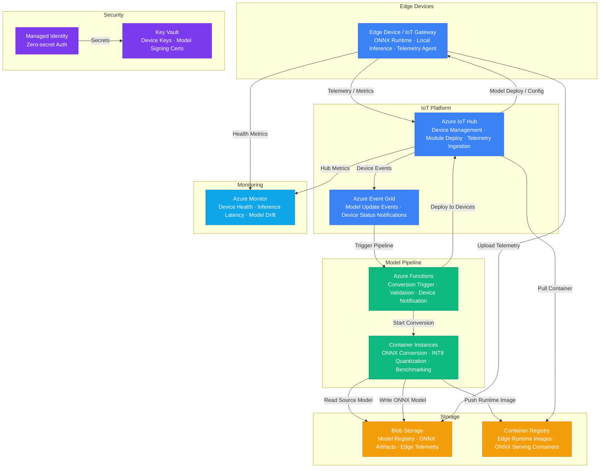

# Architecture — Play 34: Edge AI Deployment

## Overview

Edge-optimized AI deployment platform that quantizes cloud-trained models to ONNX format, deploys them to edge devices via IoT Hub, and maintains bidirectional cloud sync for telemetry and model updates. The cloud pipeline handles model conversion (PyTorch/TensorFlow → ONNX), quantization (FP32 → INT8/INT4), and benchmarking in Container Instances. Validated models are pushed to edge devices through IoT Hub device twins and module deployments. Edge devices run ONNX Runtime for low-latency local inference, uploading telemetry and accuracy metrics back to Azure for drift detection and automated retraining triggers.

## Architecture Diagram

## Data Flow

1. **Model Conversion**: Data scientist uploads a trained model (PyTorch/TensorFlow/ONNX) to Blob Storage → Event Grid triggers Azure Functions → Function spins up Container Instances with ONNX conversion tools → Model exported to ONNX format, then quantized to INT8 (or INT4 for constrained devices) → Benchmark tests run against validation dataset to verify accuracy within threshold → Quantized model and benchmark report stored in Blob Storage model registry
2. **Edge Deployment**: Functions sends deployment manifest to IoT Hub targeting device groups (by tags, firmware version, hardware capability) → IoT Hub pushes module deployment via device twins → Edge device pulls updated ONNX Runtime container from Container Registry and downloads quantized model from Blob Storage → Device validates model signature and loads into ONNX Runtime → Rollout tracked via deployment status in IoT Hub — automatic rollback on failure
3. **Local Inference**: Edge device receives input data (camera, sensor, API) → ONNX Runtime runs inference locally with sub-50ms latency → Results used for real-time decisions (alerts, control signals, classifications) → No cloud dependency required for inference — operates fully offline
4. **Telemetry Sync**: Edge device batches inference results, prediction confidence scores, and latency metrics → Uploads telemetry to IoT Hub on configurable schedule (real-time, hourly, or daily depending on connectivity) → IoT Hub routes telemetry to Blob Storage for long-term retention → Azure Monitor processes device health and inference metrics
5. **Drift Detection**: Azure Functions periodically analyzes uploaded telemetry against baseline accuracy metrics → If model accuracy drops below threshold (configurable per device group) → Triggers retraining alert and optionally kicks off new model conversion pipeline → Updated model deployed through the same IoT Hub channel

## Service Roles

| Service | Layer | Role |
|---------|-------|------|
| Azure IoT Hub | IoT Platform | Device management, module deployment, telemetry ingestion, device twins |
| Azure Event Grid | Integration | Model update notifications, device status events, pipeline triggers |
| Azure Functions | Compute | Conversion pipeline orchestration, validation, device group notification |
| Container Instances | Compute | ONNX conversion, INT8/INT4 quantization, benchmark testing |
| Blob Storage | Storage | Model registry (ONNX artifacts), edge telemetry, training datasets |
| Container Registry | Compute | Edge runtime images — ONNX Runtime containers, inference service |
| Key Vault | Security | Device provisioning keys, model signing certificates, hub connection strings |
| Managed Identity | Security | Zero-secret cloud service authentication |
| Azure Monitor | Monitoring | Device health, inference latency, model accuracy drift, deployment status |

## Security Architecture

- **Managed Identity**: All cloud services authenticate via managed identity — no secrets in pipeline code
- **Device Authentication**: X.509 certificates for device identity — provisioned via IoT Hub DPS (Device Provisioning Service)
- **Model Signing**: All ONNX models signed with Key Vault certificates — edge devices verify signatures before loading
- **Key Vault**: Device provisioning secrets and model signing keys stored in Key Vault — HSM-backed for enterprise
- **Network Isolation**: Edge devices connect to IoT Hub via TLS 1.2 — optional private endpoints for enterprise deployments
- **Firmware Integrity**: Container images in ACR signed with content trust — prevents tampered runtime deployment
- **RBAC**: Least-privilege roles — Functions get IoT Hub Contributor, ACI gets Storage Blob Data Reader
- **Data Encryption**: Telemetry encrypted in transit (TLS) and at rest (SSE) — device-side encryption for sensitive inference data

## Scaling

| Metric | Dev | Production | Enterprise |
|--------|-----|-----------|------------|
| Edge devices | 5 | 500 | 50,000+ |
| Models managed | 2 | 10 | 100+ |
| Inference/sec (per device) | 10 | 30 | 100+ |
| Model update frequency | Weekly | Daily | Continuous |
| Edge inference latency | <100ms | <50ms | <20ms |
| Model size (quantized) | 50MB | 200MB | 500MB+ |
| Telemetry upload frequency | Hourly | Every 5 min | Real-time |
| Deployment rollout | Serial | Staged (10%) | Canary + auto-rollback |
| Offline operation | 1 day | 7 days | 30+ days |
