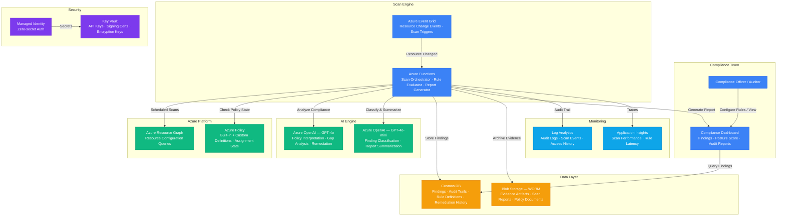

# Architecture — Play 35: AI Compliance Engine

## Overview

Automated compliance checking engine that continuously monitors Azure resources against regulatory frameworks (SOC 2, HIPAA, GDPR, PCI DSS, EU AI Act) using AI-powered policy interpretation. Azure Functions orchestrate scheduled and event-driven compliance scans, querying resource configurations via Azure Policy and Resource Graph. Azure OpenAI analyzes configurations against compliance rule sets, identifies gaps, generates human-readable findings with severity ratings, and recommends remediation steps. All findings, evidence, and audit trails are stored immutably in Cosmos DB and Blob Storage with WORM policies for regulatory retention requirements.

## Architecture Diagram

## Data Flow

1. **Scan Trigger**: Two trigger modes — (a) Scheduled: Azure Functions run on a cron schedule (hourly/daily per framework), or (b) Event-driven: Event Grid fires when an Azure resource is created, modified, or deleted → Functions receive the event with resource ID and change type
2. **Resource Discovery**: Functions query Azure Resource Graph to retrieve full resource configuration (properties, tags, networking, identity, encryption settings) → For policy-based checks, Functions also query Azure Policy for assignment state and compliance results per resource → Raw resource configurations assembled into a compliance evaluation payload
3. **AI Compliance Analysis**: Evaluation payload sent to Azure OpenAI GPT-4o with framework-specific rule sets (e.g., "HIPAA Control 164.312(a)(1): Access control — verify encryption at rest") → GPT-4o interprets the rule against the resource configuration, determines compliance status (compliant/non-compliant/needs-review), assigns severity (critical/high/medium/low), and generates human-readable finding with remediation steps → GPT-4o-mini handles bulk classification and report summarization
4. **Finding Storage**: Each finding stored in Cosmos DB with immutable metadata — resource ID, framework, control, status, severity, evidence hash, timestamp, and recommended remediation → Evidence artifacts (resource snapshots, policy state, scan context) archived to Blob Storage with WORM (Write Once Read Many) policies for regulatory retention → Audit trail written to Log Analytics with full scan lineage
5. **Reporting & Dashboard**: Compliance dashboard queries Cosmos DB for real-time posture score per framework → Drill-down views show findings by severity, resource type, subscription, and remediation status → Automated compliance reports generated on schedule (weekly/monthly) with trend analysis → Export to PDF/CSV for auditor delivery

## Service Roles

| Service | Layer | Role |
|---------|-------|------|
| Azure Functions | Compute | Scan orchestration, rule evaluation, report generation, remediation triggers |
| Azure Event Grid | Integration | Resource change notifications, scan triggers, remediation workflow events |
| Azure Policy | Governance | Built-in and custom policy definitions, assignment state, compliance baselines |
| Azure Resource Graph | Governance | Fast resource configuration queries across subscriptions |
| Azure OpenAI (GPT-4o) | AI | Policy interpretation, compliance gap analysis, remediation recommendations |
| Azure OpenAI (GPT-4o-mini) | AI | Finding classification, report summarization, bulk rule evaluation |
| Cosmos DB | Data | Compliance findings, audit trails, rule definitions, remediation history |
| Blob Storage (WORM) | Storage | Evidence artifacts, scan reports, policy documents, immutable audit records |
| Key Vault | Security | API keys, audit report signing certificates, evidence encryption keys |
| Managed Identity | Security | Zero-secret service-to-service authentication |
| Log Analytics | Monitoring | Centralized audit log, scan events, access history, Sentinel integration |
| Application Insights | Monitoring | Scan performance metrics, rule evaluation latency, API response times |

## Security Architecture

- **Managed Identity**: Functions authenticate to OpenAI, Cosmos DB, Blob Storage, Resource Graph, and Policy via managed identity
- **Key Vault**: All credentials and signing certificates stored in Key Vault — HSM-backed for enterprise compliance
- **Immutable Storage**: Evidence in Blob Storage uses WORM policies — findings cannot be modified or deleted during retention period
- **Audit Integrity**: Cosmos DB documents include SHA-256 evidence hashes — tamper detection on all compliance records
- **RBAC**: Functions get Reader on target subscriptions for scanning — never Contributor. Cosmos DB uses Data Contributor for write-back only
- **Encryption**: All data encrypted at rest (SSE + CMK for enterprise) and in transit (TLS 1.2+)
- **Access Logging**: Every access to compliance data logged in Log Analytics — full audit trail for auditor review
- **Data Residency**: Cosmos DB and Blob Storage regions configured per regulatory requirement — no cross-border data movement

## Scaling

| Metric | Dev | Production | Enterprise |
|--------|-----|-----------|------------|
| Subscriptions scanned | 1 | 10 | 100+ |
| Resources monitored | 50 | 5,000 | 100,000+ |
| Compliance frameworks | 1 | 3 | 10+ |
| Rules evaluated | 20 | 200 | 2,000+ |
| Scans per day | 2 | 24 | 288+ (every 5 min) |
| Finding resolution P95 | 48h | 24h | 4h |
| Audit report generation | Manual | Weekly | Daily |
| Evidence retention | 30 days | 1 year | 7 years |
| Function instances | 1 | 5-10 | 20-50 |
