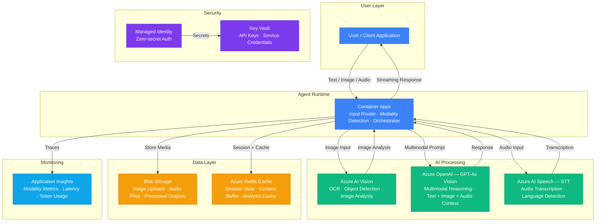

# Architecture — Play 36: Multimodal Agent

## Overview

Intelligent agent that handles text, image, and audio inputs in unified conversations. Users can send text messages, upload images, attach audio files, or combine modalities in a single turn. The agent runtime on Container Apps detects input modalities and routes processing — images go through Azure AI Vision for pre-analysis (OCR, object detection) before GPT-4o vision reasoning, audio files are transcribed via Azure AI Speech, and text is processed directly. All modalities converge into GPT-4o with vision capabilities for contextual multimodal reasoning. Conversation state and media assets persist across turns in Redis and Blob Storage.

## Architecture Diagram

## Data Flow

1. **Input Reception**: User sends a message containing one or more modalities (text, image, audio, or a combination) → Container Apps agent receives the request → Modality detection identifies input types by MIME type and content headers → Media files uploaded to Blob Storage, returning secure URLs for downstream processing
2. **Image Processing Pipeline**: Images routed to Azure AI Vision for pre-analysis → OCR extracts text from documents, screenshots, and labels → Object detection identifies entities, scenes, and spatial relationships → Pre-analysis metadata (extracted text, detected objects, image description) attached to the prompt context → Image also passed directly to GPT-4o vision as a base64-encoded or URL-referenced input for deep reasoning
3. **Audio Processing Pipeline**: Audio files (WAV, MP3, M4A, WebM) routed to Azure AI Speech STT → Real-time or batch transcription depending on file size → Language auto-detected for multilingual support → Transcribed text attached to the prompt context alongside any co-submitted text or images → Original audio reference stored in Blob for audit
4. **Multimodal Reasoning**: Agent constructs a unified prompt combining: system instructions, conversation history from Redis, current turn text, AI Vision pre-analysis metadata, transcribed audio text, and image references → GPT-4o with vision processes the complete multimodal context → Generates a contextual response that references all input modalities → Response streamed back to the user via SSE
5. **State Management**: Conversation turn (all modalities + response) stored in Redis for active session context → Media asset references maintained across turns for follow-up questions ("What else is in that image?") → On session end, conversation history optionally archived to Blob Storage → Application Insights logs per-modality processing times, token usage, and modality distribution metrics

## Service Roles

| Service | Layer | Role |
|---------|-------|------|
| Container Apps | Compute | Agent runtime, input modality router, orchestrator, streaming responses |
| Azure OpenAI (GPT-4o Vision) | AI | Multimodal reasoning across text, image, and transcribed audio context |
| Azure AI Vision | AI | Image pre-analysis — OCR, object detection, scene description |
| Azure AI Speech (STT) | AI | Audio transcription, language detection, voice message processing |
| Blob Storage | Storage | Media uploads (images, audio), processed outputs, conversation archives |
| Azure Redis Cache | Data | Active session state, multimodal context buffer, analysis result cache |
| Key Vault | Security | API keys for OpenAI, Vision, and Speech services |
| Managed Identity | Security | Zero-secret authentication across all Azure services |
| Application Insights | Monitoring | Per-modality latency, token usage, processing times, error tracking |

## Security Architecture

- **Managed Identity**: Agent authenticates to OpenAI, Vision, Speech, Blob Storage, and Redis via managed identity
- **Key Vault**: All API keys stored in Key Vault — accessed at startup, cached in memory, never in config files
- **Content Safety**: All user-uploaded images and audio screened for harmful content before processing
- **Input Validation**: File type whitelist (JPEG, PNG, WebP, WAV, MP3, M4A) — max 20MB per file, 5 files per message
- **PII Protection**: Image OCR results and audio transcriptions scanned for PII before logging — sensitive data redacted in telemetry
- **Blob Access**: Media stored with SAS tokens — time-limited (1 hour) and scoped to specific blobs, no container-level access
- **RBAC**: Agent service principal gets Cognitive Services User for AI services, Storage Blob Data Contributor for media
- **Rate Limiting**: Per-user limits — 20 messages/minute, 100MB media/hour — prevents abuse and cost spikes

## Scaling

| Metric | Dev | Production | Enterprise |
|--------|-----|-----------|------------|
| Concurrent conversations | 5 | 100 | 1,000+ |
| Messages per day | 50 | 5,000 | 100,000+ |
| Images processed/day | 20 | 2,000 | 50,000+ |
| Audio minutes/day | 10 | 500 | 10,000+ |
| Avg modalities per message | 1.2 | 1.5 | 2.0+ |
| Response P95 (text only) | 3s | 2s | 1.5s |
| Response P95 (with image) | 8s | 5s | 3s |
| Response P95 (with audio) | 10s | 6s | 4s |
| Agent replicas | 1 | 2-4 | 5-15 |
| Media storage | 1GB | 100GB | 2TB+ |
