# Architecture — Play 37: AI-Powered DevOps

## Overview

AIOps platform that augments DevOps workflows with AI-driven incident detection, root-cause analysis, and auto-remediation. Azure Monitor collects telemetry from across the estate — metrics, logs, alerts, and diagnostic data. When anomalies or alert thresholds trigger, Azure Functions ingest the events and dispatch them to Azure OpenAI for intelligent triage. GPT-4o correlates the current incident with historical patterns stored in Cosmos DB, identifies probable root causes, generates human-readable explanations, and proposes remediation runbooks. For pre-approved incident types, the system executes auto-remediation (scale-out, restart, failover) via Azure DevOps pipelines or GitHub Actions, with full audit trail in Log Analytics.

## Architecture Diagram

```mermaid
graph TB
    subgraph Operations Team
        SRE[SRE / Platform Engineer]
        Dashboard[Ops Dashboard<br/>Incident Feed · MTTR · AI Accuracy]
    end

    subgraph Telemetry Ingestion
        Monitor[Azure Monitor<br/>Metrics · Alerts · Diagnostics]
        LogAnalytics[Log Analytics<br/>KQL Queries · Anomaly Detection · Audit Trail]
    end

    subgraph AIOps Engine
        Functions[Azure Functions<br/>Alert Ingestion · AI Triage Dispatch · Remediation Executor]
        OpenAI[Azure OpenAI — GPT-4o<br/>Root-Cause Analysis · Runbook Generation · Risk Scoring]
        Mini[Azure OpenAI — GPT-4o-mini<br/>Alert Classification · Deduplication · Summaries]
    end

    subgraph Knowledge Store
        CosmosDB[Cosmos DB<br/>Incident History · Correlation Patterns · Playbooks]
    end

    subgraph Automation
        DevOps[Azure DevOps Pipelines<br/>Auto-Remediation · Rollback · Scale-out]
        GitHub[GitHub Actions<br/>IaC Drift Fix · Config Restore · PR Generation]
    end

    subgraph Security
        KV[Key Vault<br/>API Keys · PATs · Webhook Secrets]
        MI[Managed Identity<br/>Zero-secret Auth]
    end

    subgraph Monitoring
        AppInsights[Application Insights<br/>AIOps Latency · Triage Accuracy · Remediation Success]
    end

    Monitor -->|Alerts & Metrics| Functions
    LogAnalytics -->|Correlated Logs| Functions
    Functions -->|Classify Alert| Mini
    Functions -->|Root-Cause Analysis| OpenAI
    Functions -->|Historical Lookup| CosmosDB
    OpenAI -->|Analysis + Runbook| Functions
    Functions -->|Auto-Remediate| DevOps
    Functions -->|IaC Drift Fix| GitHub
    Functions -->|Store Finding| CosmosDB
    Functions -->|Audit Trail| LogAnalytics
    SRE -->|Review / Approve| Dashboard
    Dashboard -->|Query Incidents| CosmosDB
    MI -->|Secrets| KV
    Functions -->|Traces| AppInsights

    style SRE fill:#3b82f6,color:#fff,stroke:#2563eb
    style Dashboard fill:#3b82f6,color:#fff,stroke:#2563eb
    style Monitor fill:#0ea5e9,color:#fff,stroke:#0284c7
    style LogAnalytics fill:#0ea5e9,color:#fff,stroke:#0284c7
    style Functions fill:#3b82f6,color:#fff,stroke:#2563eb
    style OpenAI fill:#10b981,color:#fff,stroke:#059669
    style Mini fill:#10b981,color:#fff,stroke:#059669
    style CosmosDB fill:#f59e0b,color:#fff,stroke:#d97706
    style DevOps fill:#3b82f6,color:#fff,stroke:#2563eb
    style GitHub fill:#3b82f6,color:#fff,stroke:#2563eb
    style KV fill:#7c3aed,color:#fff,stroke:#6d28d9
    style MI fill:#7c3aed,color:#fff,stroke:#6d28d9
    style AppInsights fill:#0ea5e9,color:#fff,stroke:#0284c7
```

## Data Flow

1. **Telemetry Collection**: Azure Monitor continuously collects metrics, logs, and diagnostics from monitored resources (VMs, AKS, App Services, databases) → Alert rules fire when thresholds are breached or anomalies detected → Log Analytics stores raw telemetry for KQL-based correlation → Alert payloads (severity, resource ID, metric values, affected service) sent to Azure Functions via Action Groups
2. **Alert Triage**: Functions receive alert events and perform initial deduplication — same resource + same alert within 5 minutes is grouped → GPT-4o-mini classifies the alert (category, likely blast radius, urgency) → For P1/P2 incidents, Functions query Cosmos DB for historical incidents on the same resource type or service topology → Correlated context assembled into an analysis payload
3. **Root-Cause Analysis**: Analysis payload sent to GPT-4o with incident context: current alert details, correlated log snippets from Log Analytics (last 30 minutes), historical similar incidents from Cosmos DB, and resource dependency graph → GPT-4o produces: probable root cause (ranked), human-readable explanation, recommended remediation steps, confidence score, and estimated blast radius → Response stored in Cosmos DB as a new incident record
4. **Auto-Remediation**: For pre-approved incident types (e.g., disk full, certificate expiry, pod crash loop, config drift), Functions trigger automated remediation → Azure DevOps Pipelines execute infrastructure runbooks (scale-out VMSS, restart App Service, failover database) → GitHub Actions handle IaC drift correction (regenerate Terraform plan, create PR for review) → All remediation actions logged with before/after state in Log Analytics
5. **Human Review & Learning**: SRE reviews AI-generated analysis and remediation results on the Ops Dashboard → Approved remediations update the confidence score for that incident pattern in Cosmos DB → Rejected analyses feed back as negative examples to improve future triage accuracy → Weekly AI-generated postmortem reports summarize incident trends, MTTR improvements, and recurring patterns

## Service Roles

| Service | Layer | Role |
|---------|-------|------|
| Azure Monitor | Telemetry | Metrics collection, alert rules, anomaly detection, diagnostic settings |
| Log Analytics | Telemetry | Centralized log store, KQL queries, incident correlation, audit trail |
| Azure Functions | Compute | Alert ingestion, AI triage dispatch, remediation orchestration, notification |
| Azure OpenAI (GPT-4o) | AI | Root-cause analysis, runbook generation, change-risk scoring, postmortems |
| Azure OpenAI (GPT-4o-mini) | AI | Alert classification, deduplication, summary generation |
| Cosmos DB | Data | Incident knowledge base, correlation patterns, remediation playbooks |
| Azure DevOps | Automation | Pipeline-driven remediation, rollback triggers, release gate AI checks |
| GitHub Actions | Automation | IaC drift correction, config restoration, automated PR generation |
| Key Vault | Security | API keys, DevOps PATs, webhook secrets, service credentials |
| Managed Identity | Security | Zero-secret authentication across all Azure services |
| Application Insights | Monitoring | AIOps pipeline metrics, triage latency, remediation success rates |

## Security Architecture

- **Managed Identity**: Functions authenticate to OpenAI, Cosmos DB, Log Analytics, and Monitor via managed identity — no stored credentials
- **Key Vault**: DevOps PATs, GitHub tokens, and webhook signing secrets stored in Key Vault — rotated on 90-day schedule
- **RBAC**: Functions get Monitoring Reader for telemetry access, Cosmos DB Data Contributor for incident writes — never Contributor on monitored resources
- **Remediation Scoping**: Auto-remediation actions execute through dedicated service principals with narrowly scoped permissions (e.g., VMSS Contributor on specific scale sets only)
- **Approval Gates**: P1 remediations require human approval in Azure DevOps before execution — only P3/P4 patterns with >95% confidence auto-execute
- **Audit Trail**: Every AI analysis, remediation action, and approval decision logged immutably in Log Analytics with correlation IDs
- **Network Isolation**: Functions deployed in VNET with private endpoints to OpenAI and Cosmos DB in production
- **Alert Integrity**: Webhook payloads validated via HMAC signatures — prevents spoofed alert injection

## Scaling

| Metric | Dev | Production | Enterprise |
|--------|-----|-----------|------------|
| Monitored resources | 20 | 500 | 10,000+ |
| Alerts per day | 10 | 500 | 20,000+ |
| AI triage requests/day | 10 | 200 | 5,000+ |
| Auto-remediations/day | 0 | 20 | 500+ |
| Incident correlation P95 | 15s | 8s | 3s |
| MTTR improvement | Baseline | 40% reduction | 70% reduction |
| Historical incident lookups | 100 | 10,000 | 500,000+ |
| Function instances | 1 | 5-10 | 20-50 |
| Log retention | 7 days | 90 days | 365 days |
