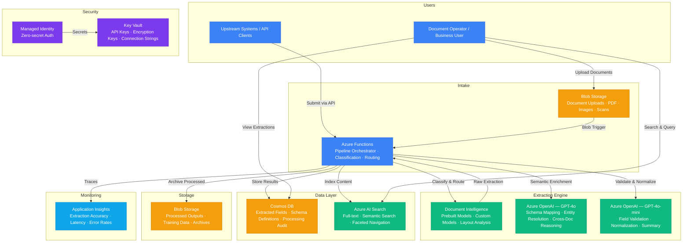

# Architecture — Play 38: Document Understanding V2

## Overview

Advanced document processing platform that combines Azure Document Intelligence's layout-aware extraction with Azure OpenAI's semantic understanding to handle complex, variable-format documents. Unlike basic OCR pipelines, this system supports custom extraction schemas — users define the fields they need (e.g., "vendor name", "line items", "payment terms") and the platform trains custom Document Intelligence models or maps GPT-4o reasoning to extract them. The pipeline handles intake (Blob Storage), classification (prebuilt vs custom routing), extraction (Document Intelligence), semantic enrichment (GPT-4o for entity resolution, cross-reference, and validation), and output (structured JSON to Cosmos DB with full-text search via AI Search).

## Architecture Diagram

## Data Flow

1. **Document Intake**: Documents arrive via Blob Storage uploads (drag-drop portal, programmatic upload) or REST API submission → Blob trigger fires Azure Functions pipeline → Functions extract file metadata (type, size, page count) and assign a processing correlation ID → Original document stored in Blob with versioning enabled for audit trail
2. **Classification & Routing**: Functions analyze the document to determine the best extraction path → Page 1 sampled by Document Intelligence Layout API for structural features → Classifier routes to: prebuilt models (invoice, receipt, W-2, ID, health insurance) for known formats, custom-trained models for organization-specific forms, or GPT-4o vision for unstructured/novel documents → Classification result logged with confidence score
3. **Extraction**: Document Intelligence processes the document with the selected model → Layout analysis preserves spatial relationships (tables, key-value pairs, checkboxes, signatures) → Prebuilt models extract standardized fields (vendor name, total, line items) → Custom models extract user-defined schema fields trained on labeled examples → Raw extraction results include field values, confidence scores, bounding boxes, and page numbers
4. **AI Enrichment**: Raw extraction results sent to GPT-4o for semantic enhancement → Entity resolution: normalizes vendor names ("Microsoft Corp" = "MSFT" = "Microsoft Corporation"), standardizes dates and currencies → Cross-document reasoning: links invoice line items to purchase orders, matches payment terms across contracts → Schema mapping: maps extracted fields to the user-defined output schema → GPT-4o-mini handles simple validations (format checks, range validation, required field verification) → Enriched results assembled into structured JSON
5. **Storage & Discovery**: Final structured JSON stored in Cosmos DB with full field-level indexing → AI Search indexes document content for full-text and semantic search with faceted navigation (by vendor, date range, document type) → Processed outputs written to Blob Storage in customer-defined formats (JSON, CSV, XML) → Application Insights logs per-document processing metrics — extraction confidence, AI enrichment time, total pipeline duration

## Service Roles

| Service | Layer | Role |
|---------|-------|------|
| Azure Document Intelligence | AI | Layout analysis, prebuilt extraction (invoice, receipt, ID), custom model training and inference |
| Azure OpenAI (GPT-4o) | AI | Semantic enrichment, entity resolution, cross-document reasoning, complex schema mapping |
| Azure OpenAI (GPT-4o-mini) | AI | Field validation, data normalization, summary generation |
| Azure Functions | Compute | Pipeline orchestration, document classification, routing, output formatting |
| Blob Storage | Storage | Source documents, processed outputs, training data, archive with versioning |
| Cosmos DB | Data | Extracted field data, schema definitions, processing audit trail, entity relationships |
| Azure AI Search | Search | Full-text and semantic search over extracted content, faceted document discovery |
| Key Vault | Security | API keys, document encryption keys, storage connection strings |
| Managed Identity | Security | Zero-secret authentication across all Azure services |
| Application Insights | Monitoring | Extraction accuracy, pipeline latency, per-model performance, error rates |

## Security Architecture

- **Managed Identity**: Functions authenticate to Document Intelligence, OpenAI, Cosmos DB, Blob Storage, and AI Search via managed identity
- **Key Vault**: All API keys and customer-managed encryption keys stored in Key Vault — accessed at startup, never in config
- **Document Encryption**: Source documents encrypted at rest with CMK in enterprise tier — Key Vault manages rotation
- **PII Detection**: Extracted fields scanned for PII (SSN, credit card, health data) → PII fields flagged and optionally redacted before storage
- **RBAC**: Functions get Cognitive Services User for AI services, Storage Blob Data Contributor for documents, Cosmos DB Data Contributor for results
- **Input Validation**: File type whitelist (PDF, TIFF, JPEG, PNG, BMP, DOCX) — max 200MB per file, malware scan before processing
- **Network Isolation**: Document Intelligence and OpenAI accessed via private endpoints in production — no public internet exposure
- **Audit Trail**: Every document processing step logged with correlation ID — who uploaded, when processed, what extracted, confidence scores

## Scaling

| Metric | Dev | Production | Enterprise |
|--------|-----|-----------|------------|
| Documents per day | 20 | 1,000 | 50,000+ |
| Pages per day | 100 | 10,000 | 500,000+ |
| Custom models | 1 | 5 | 20+ |
| Document types supported | 3 | 15 | 50+ |
| Extraction accuracy | 85% | 92% | 97%+ |
| Pipeline P95 latency | 30s | 15s | 8s |
| AI Search index size | 50MB | 10GB | 100GB+ |
| Concurrent pipelines | 1 | 10 | 100+ |
| Storage retention | 30 days | 1 year | 7 years |
