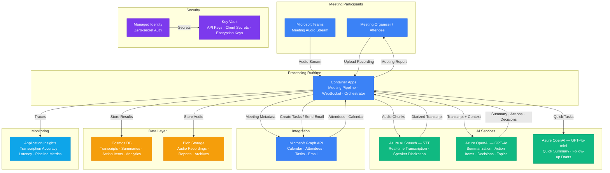

# Architecture — Play 39: AI Meeting Assistant

## Overview

Meeting intelligence platform that provides real-time transcription, automated summarization, action item extraction, and decision logging for Teams and custom meetings. Azure AI Speech handles speech-to-text with speaker diarization, identifying who said what. Container Apps orchestrate the processing pipeline — connecting transcription output to Azure OpenAI for intelligent analysis. GPT-4o segments meeting content by topic, generates concise summaries, extracts action items with assignees and deadlines, logs key decisions, and drafts follow-up emails. Microsoft Graph integration pulls meeting metadata (attendees, calendar context, recurring series) and pushes action items back as Outlook tasks or Planner cards.

## Architecture Diagram

## Data Flow

1. **Audio Capture**: Meeting audio arrives via two modes — (a) Real-time: Teams meeting bot streams audio chunks via WebSocket to Container Apps, or (b) Post-meeting: user uploads a recorded audio file (WAV, MP3, M4A) to the processing endpoint → Container Apps assigns a meeting session ID and retrieves meeting metadata (attendees, title, agenda) from Microsoft Graph calendar events
2. **Transcription**: Audio chunks sent to Azure AI Speech for speech-to-text → Real-time mode: continuous recognition with interim results streamed back to the meeting UI → Speaker diarization identifies individual speakers by voice signature and labels each utterance (Speaker 1, Speaker 2, etc.) → Speaker labels mapped to attendee names via Graph API attendee list and optional voice enrollment → Punctuation restoration and profanity filtering applied → Complete diarized transcript with timestamps assembled
3. **AI Analysis**: Diarized transcript sent to GPT-4o in structured chunks (by time segment or topic boundary) → Topic segmentation: AI identifies distinct discussion topics and creates section headers → Summarization: concise summary per topic (2-3 sentences) plus overall meeting summary → Action item extraction: identifies commitments with assignee, description, and deadline ("John will send the proposal by Friday") → Decision logging: captures agreed-upon decisions with supporting context → Sentiment highlights: flags contentious or high-energy discussion segments
4. **Integration & Output**: Action items pushed to Microsoft Graph → created as Outlook Tasks assigned to the identified person, or Planner cards in the meeting's associated plan → Follow-up email drafted by GPT-4o-mini containing summary, action items, and decision log → sent via Graph API to all attendees → Meeting report (summary + transcript + actions) stored in Cosmos DB → Audio recording archived in Blob Storage with retention policies
5. **Analytics & Search**: Cosmos DB enables cross-meeting analytics — track action item completion rates, meeting duration trends, speaking time distribution → Users search across meeting history by keyword, attendee, date, or topic → Application Insights tracks transcription accuracy (Word Error Rate), summarization latency, and action item extraction precision

## Service Roles

| Service | Layer | Role |
|---------|-------|------|
| Azure AI Speech (STT) | AI | Real-time and batch transcription, speaker diarization, language detection |
| Azure OpenAI (GPT-4o) | AI | Meeting summarization, topic segmentation, action item extraction, decision logging |
| Azure OpenAI (GPT-4o-mini) | AI | Quick summaries, follow-up email drafting, simple extraction tasks |
| Container Apps | Compute | Meeting pipeline runtime, WebSocket handling, orchestration, streaming |
| Microsoft Graph API | Integration | Calendar metadata, attendee resolution, task creation, email sending |
| Cosmos DB | Data | Meeting transcripts, summaries, action items, analytics, search |
| Blob Storage | Storage | Audio recordings, generated reports, transcript archives |
| Key Vault | Security | API keys, Graph client secrets, encryption keys |
| Managed Identity | Security | Zero-secret authentication across Azure services |
| Application Insights | Monitoring | Transcription accuracy, pipeline latency, extraction metrics |

## Security Architecture

- **Managed Identity**: Container Apps authenticate to Speech, OpenAI, Cosmos DB, and Blob Storage via managed identity
- **Key Vault**: Graph API client secret and any non-MI credentials stored in Key Vault — rotated on 90-day schedule
- **Meeting Consent**: Meeting bot requires explicit organizer consent to join and record — consent status logged per meeting
- **PII Protection**: Speaker names and attendee emails redacted from telemetry logs — transcript PII (phone numbers, addresses) detected and masked in analytics
- **Audio Encryption**: Meeting recordings encrypted at rest with SSE (CMK for enterprise) — access restricted to meeting organizer and attendees via RBAC
- **RBAC**: Container Apps get Cognitive Services User for Speech/OpenAI, Cosmos DB Data Contributor for meeting data
- **Data Retention**: Configurable per organization — default 90 days for audio, 1 year for transcripts, indefinite for action items
- **Network Isolation**: Speech and OpenAI accessed via private endpoints in production — audio never traverses public internet

## Scaling

| Metric | Dev | Production | Enterprise |
|--------|-----|-----------|------------|
| Meetings per day | 5 | 200 | 5,000+ |
| Concurrent real-time meetings | 1 | 20 | 200+ |
| Avg meeting duration (min) | 30 | 45 | 60 |
| Audio hours processed/day | 2.5 | 150 | 5,000+ |
| Action items extracted/day | 10 | 500 | 15,000+ |
| Transcription WER | <15% | <10% | <8% |
| Summary generation P95 | 15s | 8s | 5s |
| Container replicas | 1 | 2-4 | 10-30 |
| Storage (audio) | 1GB | 100GB | 5TB+ |
