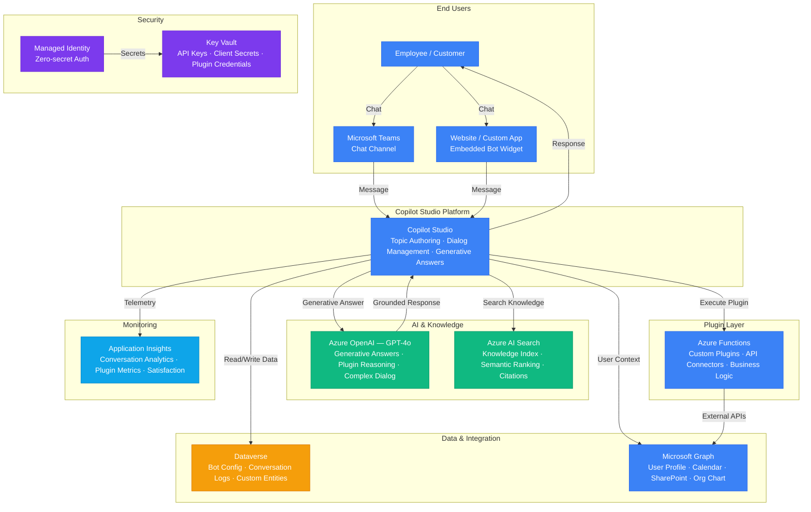

# Architecture — Play 40: Copilot Studio Advanced

## Overview

Enterprise-grade Copilot Studio deployment with custom agents, plugin extensibility, and knowledge-grounded generative answers. Goes beyond basic bot authoring to deliver multi-channel virtual assistants that integrate deeply with organizational data. Copilot Studio handles dialog management, topic routing, and generative AI answers using Azure OpenAI. Custom plugins built on Azure Functions extend capabilities — connecting to LOB systems, performing data lookups, executing business workflows. Knowledge bases sourced from SharePoint, web pages, and custom data are indexed via Azure AI Search for grounded, citation-backed responses. Microsoft Graph provides user context (profile, calendar, org chart) for personalized interactions. Dataverse stores bot configurations, conversation logs, and custom entities.

## Architecture Diagram

## Data Flow

1. **User Interaction**: User sends a message via Teams, web chat widget, or custom app channel → Copilot Studio receives the message and begins topic matching → Built-in NLU classifies intent and extracts entities → If a matching authored topic exists (e.g., "Reset my password", "Book a meeting room"), the topic's dialog flow executes → If no topic matches, the message is routed to generative answers
2. **Generative Answers**: Copilot Studio queries Azure AI Search with the user's message for relevant knowledge → AI Search returns top-k results from indexed SharePoint libraries, uploaded documents, and web pages with semantic ranking → Results passed to Azure OpenAI GPT-4o as grounding context → GPT-4o generates a natural language answer with citations referencing the source documents → Response delivered back to the user with clickable source links
3. **Plugin Execution**: When a conversation requires external action (lookup order status, create a ticket, check inventory), Copilot Studio invokes a custom plugin → Plugin is an Azure Functions HTTP endpoint with OpenAPI specification registered in Copilot Studio → Functions execute business logic — calling LOB REST APIs, querying databases, performing calculations → Plugin response returned to Copilot Studio → GPT-4o formats the structured plugin response into conversational language
4. **Context & Personalization**: Microsoft Graph provides user context throughout the conversation → User profile (name, department, manager) personalizes greetings and routing → Calendar availability checked for meeting booking topics → SharePoint permissions respected — users only see search results they have access to → Org chart used for escalation routing ("Connect me to my manager's manager")
5. **Analytics & Improvement**: Conversation data stored in Dataverse — session transcripts, topic hit rates, escalation frequency, user satisfaction scores → Application Insights tracks real-time metrics — generative answer quality (groundedness), plugin success/failure rates, conversation completion rates → Analytics dashboard identifies top unanswered questions → Content gaps feed back into knowledge base expansion and new topic authoring

## Service Roles

| Service | Layer | Role |
|---------|-------|------|
| Copilot Studio | Platform | Topic authoring, dialog management, NLU, generative answers orchestration, multi-channel |
| Azure OpenAI (GPT-4o) | AI | Generative answers, complex dialog reasoning, plugin response formatting |
| Azure AI Search | Knowledge | Knowledge base indexing, semantic ranking, citation-backed retrieval |
| Azure Functions | Compute | Custom plugin backends, API connectors, business logic, workflow triggers |
| Dataverse | Data | Bot configuration, conversation logs, topic definitions, custom entities |
| Microsoft Graph | Integration | User profiles, calendar, SharePoint, Teams presence, task creation |
| Key Vault | Security | API keys, plugin credentials, Graph client secrets |
| Managed Identity | Security | Zero-secret authentication for Azure service connections |
| Application Insights | Monitoring | Conversation analytics, generative answer quality, plugin metrics |

## Security Architecture

- **Entra ID Authentication**: All user interactions authenticated via Microsoft Entra ID — SSO across Teams and web channels
- **Managed Identity**: Functions and AI Search authenticate to OpenAI and Dataverse via managed identity
- **Key Vault**: Plugin API credentials, external connector tokens, and Graph client secrets stored in Key Vault
- **DLP Policies**: Dataverse DLP policies restrict which connectors and data flows the bot can access — prevent data exfiltration via plugins
- **Content Safety**: Azure AI Content Safety filters applied to all generative answers — blocks harmful, biased, or inappropriate responses
- **SharePoint Permissions**: AI Search respects SharePoint document permissions — users only retrieve documents they are authorized to view
- **RBAC**: Bot authors get Copilot Studio Maker role, operators get Bot Transcript Reader, end users have no direct resource access
- **Conversation Logging**: All conversations logged in Dataverse with retention policies — PII redacted from analytics but preserved in audit trail with access controls
- **Plugin Sandboxing**: Custom plugins execute in isolated Azure Functions — no direct access to Copilot Studio internals or other tenant data

## Scaling

| Metric | Dev | Production | Enterprise |
|--------|-----|-----------|------------|
| Monthly sessions | 100 | 1,000 | 5,000+ |
| Concurrent conversations | 5 | 50 | 500+ |
| Topics authored | 10 | 50 | 200+ |
| Custom plugins | 2 | 10 | 30+ |
| Knowledge sources | 1 | 5 | 20+ |
| Knowledge base size | 50MB | 2GB | 25GB+ |
| Generative answer P95 | 5s | 3s | 2s |
| Plugin response P95 | 3s | 2s | 1s |
| Channels | 1 | 3 | 5+ |
| Conversation completion rate | 60% | 80% | 90%+ |
