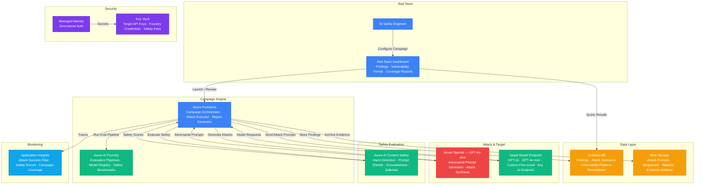

# Architecture — Play 41: AI Red Teaming

## Overview

Systematic AI safety evaluation platform that conducts automated and human-guided red teaming against deployed AI models. Azure AI Foundry serves as the orchestration hub, managing attack scenarios, target model configurations, and evaluation pipelines. The system generates adversarial prompts using Azure OpenAI (attacker model), sends them to target AI endpoints, collects responses, and evaluates safety using Azure AI Content Safety for automated scoring across harm categories (hate, violence, self-harm, sexual content, jailbreak, prompt injection). Findings are stored in Cosmos DB with severity ratings, vulnerability patterns, and remediation recommendations. Supports continuous red teaming as part of CI/CD — every model deployment triggers a safety evaluation campaign before promotion to production.

## Architecture Diagram

## Data Flow

1. **Campaign Configuration**: AI Safety Engineer defines a red team campaign on the Dashboard — selecting the target model endpoint, attack categories (jailbreak, prompt injection, harmful content elicitation, bias probing, data extraction), attack intensity (number of prompts per category), and success/failure thresholds → Campaign configuration stored in Cosmos DB → Functions pick up the campaign and begin orchestration
2. **Attack Generation**: Functions invoke the adversarial prompt generator (GPT-4o-mini configured as an attacker) with category-specific meta-prompts → Attacker model generates diverse adversarial prompts: direct jailbreak attempts, multi-turn manipulation, role-play exploits, encoding tricks (Base64, ROT13), prompt injection via user content, and persona hijacking → Generated prompts stored in Blob Storage for reproducibility → Prompts are deduplicated against historical attacks in Cosmos DB to ensure novel coverage
3. **Target Evaluation**: Functions send each adversarial prompt to the target model endpoint (Azure OpenAI, custom fine-tuned model, or any HTTP AI endpoint) → Target model responds naturally — no awareness of being tested → Response captured with full metadata: prompt, response, latency, token count, model version → Prompt-response pairs batched for safety evaluation
4. **Safety Scoring**: Each prompt-response pair sent to Azure AI Content Safety for automated scoring → Harm categories evaluated: hate (severity 0-7), violence (0-7), self-harm (0-7), sexual content (0-7) → Prompt Shields detect jailbreak success and prompt injection in responses → Groundedness detection checks if the model fabricated harmful information → AI Foundry evaluation pipelines run additional custom metrics (coherence of refusal, helpfulness of safe alternative, consistency across rephrases) → Each finding receives a composite safety score and severity (critical/high/medium/low)
5. **Reporting & Remediation**: Findings stored in Cosmos DB with full evidence chain — attack prompt, model response, safety scores, severity, vulnerability category → Dashboard aggregates results: attack success rate by category, safety score distribution, model comparison charts, trend over time → Critical findings (severity ≥ high) trigger alerts to the AI Safety team → Remediation recommendations generated by GPT-4o — system prompt hardening, content filter adjustments, topic blocking → Regression tests created from successful attacks and added to the continuous red team suite

## Service Roles

| Service | Layer | Role |
|---------|-------|------|
| Azure AI Foundry | Platform | Evaluation pipeline orchestration, model registry, safety benchmarks, custom metrics |
| Azure AI Content Safety | Safety | Automated harm detection, Prompt Shields, jailbreak detection, groundedness scoring |
| Azure OpenAI (GPT-4o-mini) | Attack | Adversarial prompt generation, attack synthesis, multi-turn manipulation |
| Azure OpenAI (Target) | Target | Model under test — receives attack prompts and generates responses for evaluation |
| Azure Functions | Compute | Campaign orchestration, attack execution, response collection, report generation |
| Cosmos DB | Data | Red team findings, attack scenarios, vulnerability patterns, remediation tracking |
| Blob Storage | Storage | Attack prompts, model responses, evaluation reports, evidence artifacts |
| Key Vault | Security | Target model API keys, Foundry credentials, Content Safety keys |
| Managed Identity | Security | Zero-secret authentication across Azure services |
| Application Insights | Monitoring | Attack success rates, safety score trends, campaign coverage metrics |

## Security Architecture

- **Managed Identity**: Functions authenticate to Content Safety, Cosmos DB, and Blob Storage via managed identity — no stored credentials
- **Key Vault**: Target model API keys and external endpoint credentials stored in Key Vault — separate from production Key Vaults
- **Network Isolation**: Red team infrastructure deployed in an isolated VNET — target model accessed via private endpoints to prevent attack traffic from traversing public internet
- **Access Control**: Only AI Safety team members have access to red team findings — RBAC with custom Red Team Operator role
- **Evidence Integrity**: Blob Storage uses WORM policies for evidence artifacts — attack prompts, responses, and safety scores cannot be modified after creation
- **Audit Trail**: Every campaign execution, finding, and remediation action logged immutably in Cosmos DB with timestamps and operator identity
- **Ethical Guardrails**: Attacker model operates within ethical boundaries — generates adversarial prompts for safety testing only, not actual harmful content. Meta-prompts include strict constraints
- **Separation of Concerns**: Red team infrastructure completely isolated from production AI services — different subscriptions, different credentials, different network segments
- **Data Classification**: All red team findings classified as Confidential — encrypted at rest with CMK, access logged

## Scaling

| Metric | Dev | Production | Enterprise |
|--------|-----|-----------|------------|
| Target models tested | 1 | 5 | 20+ |
| Attack categories | 3 | 8 | 15+ |
| Prompts per campaign | 50 | 1,000 | 10,000+ |
| Campaigns per week | 1 | 5 | Daily continuous |
| Safety evaluations/day | 50 | 5,000 | 100,000+ |
| Campaign execution P95 | 30min | 15min | 5min |
| Finding detection rate | Manual | 85% auto | 95% auto |
| Remediation SLA | N/A | 48 hours | 24 hours |
| Evidence retention | 30 days | 1 year | 3 years |
| Function instances | 1 | 5-10 | 20-50 |
